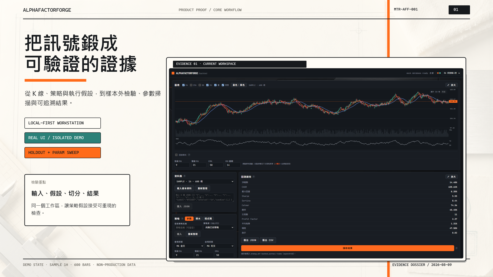
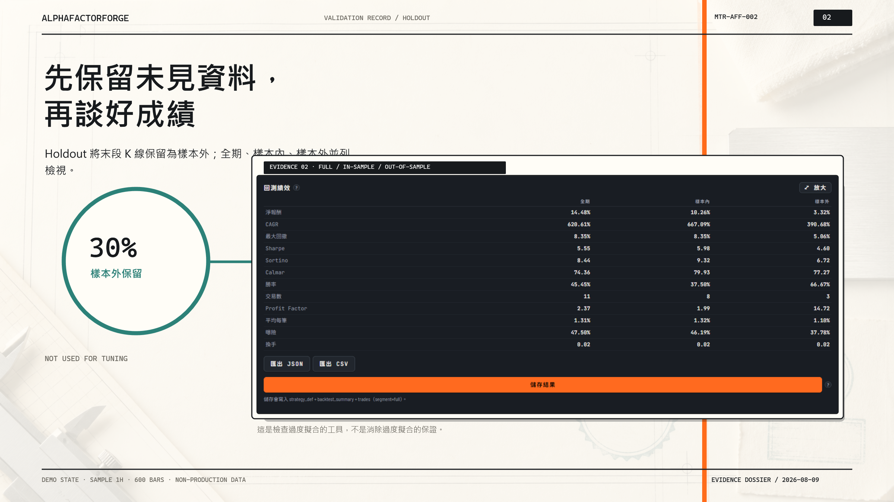
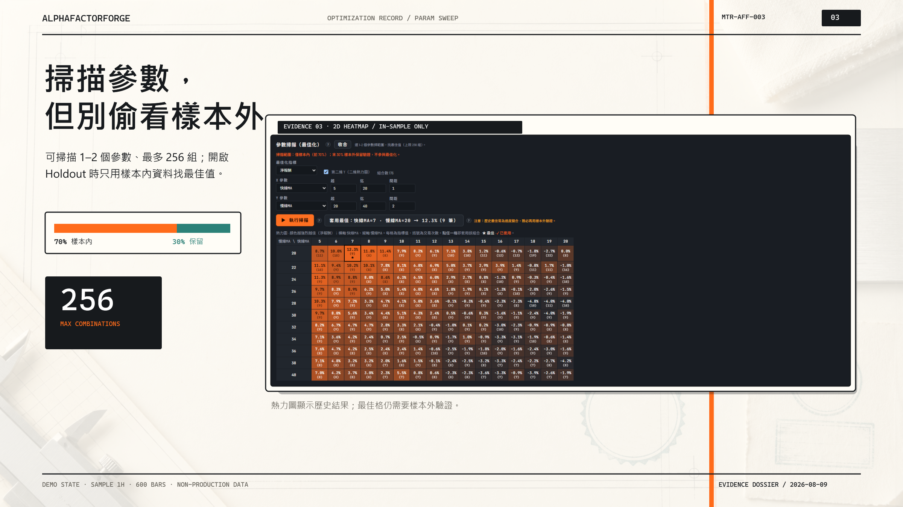
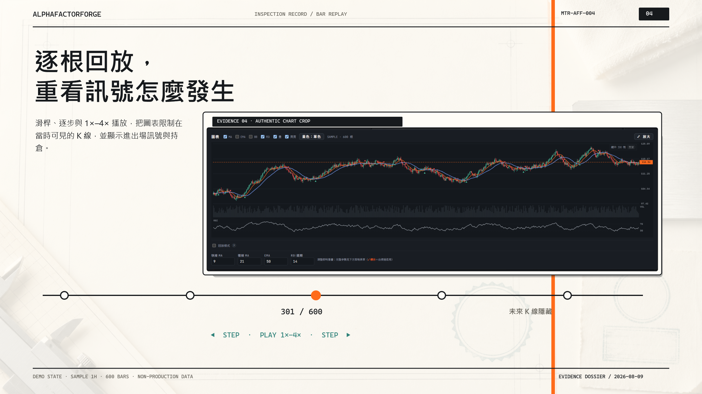
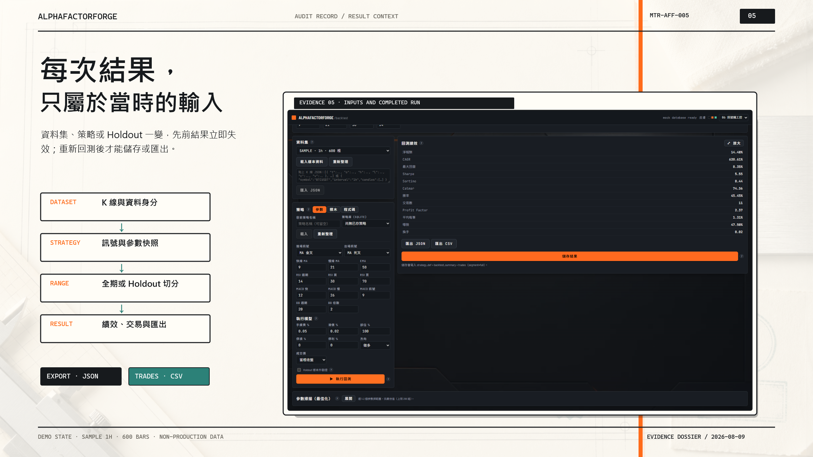
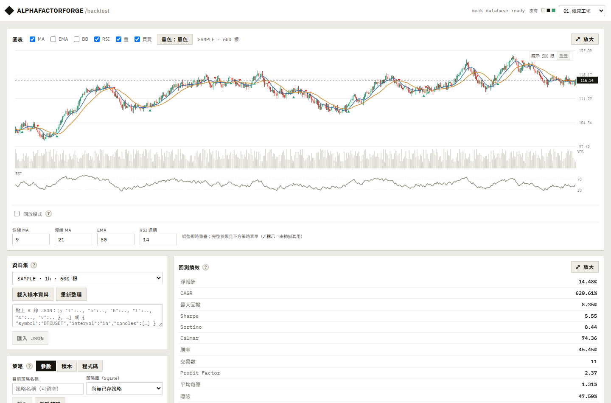
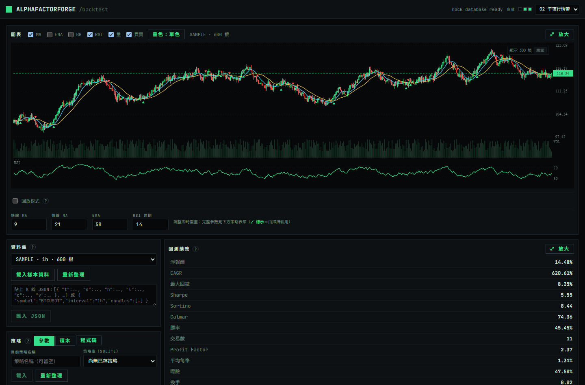
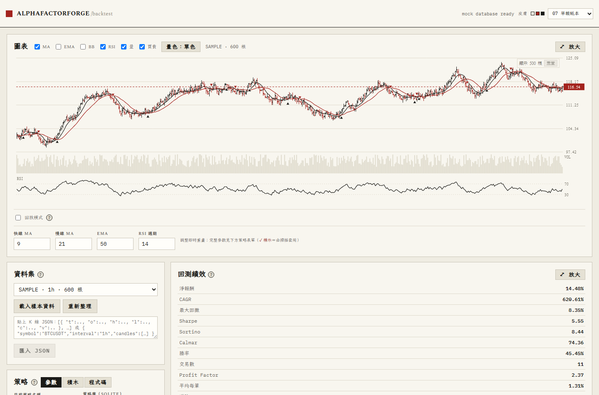

# AlphaFactorForge

**讓 AI 提出策略，讓歷史資料檢查它是否值得相信。**

AlphaFactorForge 的核心目標，是讓 AI 生成受約束的 JSON Strategy DSL 策略候選，再用歷史 K 線、明確的執行假設與嚴格的資料切分，檢查策略是否值得進入下一階段驗證。它不是要替 AI 的答案找一張漂亮績效圖，而是要建立一條可以重現、檢查、淘汰與稽核的策略研究流水線。

歷史回測無法保證未來獲利，但可以更早排除只在已知資料上成立、依賴特定參數或無法解釋訊號來源的候選策略。



## 核心產品循環

`AI 生成策略候選 → DSL 白名單驗證 → 歷史回測 → Holdout 樣本外檢驗 → 淘汰或繼續驗證`

| 階段 | 作用 | 目前狀態 |
|---|---|---|
| AI 生成策略候選 | 由 AI 提出新的指標組合與策略假說，只允許輸出受限 JSON Strategy DSL | **產品核心目標；完整 AI Strategy Lab 前端與 provider 串接仍在 Phase C** |
| DSL 安全驗證 | 以 schema 與白名單 validator 拒絕不合法結構，不讓 AI 產生任意可執行程式碼 | **核心契約已具備** |
| 歷史資料回測 | 在費用、滑價、倉位與成交模型下重算策略表現 | **目前工作區已具備** |
| 樣本內外檢驗 | 使用 Holdout 與樣本內參數掃描，避免未見資料參與調參 | **目前工作區已具備** |
| 稽核與決策 | 逐根回放訊號、綁定輸入脈絡，並匯出 JSON／CSV 證據 | **目前工作區已具備** |

> 現況界線：目前可直接展示與驗證的是歷史回測工作區、Strategy DSL validator、Discovery backend 基礎與下列檢驗工具；完整 AI 生成操作流程尚未在前端接線。本 README 會同時說明產品目標與目前可查驗的能力，不把 roadmap 當成已完成介面。

## AI 策略要通過哪些歷史檢驗？

### 1. 先保留未見資料，再談好成績

Holdout 將末段 K 線保留為樣本外資料，並列全期、樣本內與樣本外績效。AI 產生的候選若只記住已知行情，落差會更容易被看見。



### 2. 掃描參數，但不偷看樣本外

支援 1–2 軸、最多 256 組參數組合；啟用 Holdout 時，最佳化只使用樣本內資料，保留末段資料作為獨立檢驗。



### 3. 逐根回放訊號形成過程

透過滑桿、單步與 1×–4× 播放重看 K 線、訊號與持倉，並隱藏游標之後的行情，檢查策略在當時究竟看見了什麼。



### 4. 讓每次結果保留當時的輸入脈絡

完成結果綁定資料集、策略與 Holdout 設定；輸入變更後舊結果失效，重新回測後才能儲存或匯出 JSON 報告與交易 CSV。



> Campaign 畫面使用隔離的 deterministic SAMPLE 示範資料；其中績效數字只用來展示產品輸出格式，不代表實際或未來報酬。策略通過歷史回測也不等於可以直接使用，仍需要隱藏測試、paper trading 與風險審查。

[瀏覽完整產品 Campaign](showcase/contact-sheet.png) · [查看素材與實證 metadata](showcase/)

---

**Automated Indicator Discovery Workstation**<br>
中文定位：**自動因子鍛造與驗證工作站**<br>
日本語：**自動インジケーター発見・検証ワークステーション**

Repository: `https://github.com/yoyoCadence/AlphaFactorForge`

Languages:

- [中文](#中文)
- [English](#english)
- [日本語](#日本語)

---

## 畫面 · Screenshots · スクリーンショット

> 實機截圖 / Real screenshots / 実機スクリーンショット



回測工作站：K 線與 MA／成交量／RSI、進出場標記、末價標籤，下方為資料集、策略表單與績效表
（淨報酬、CAGR、最大回撤、Sharpe／Sortino／Calmar、勝率、Profit Factor…）。

十種可切換皮膚，右上角即時切換——不只換色，K 棒畫法、密度、字體與版面比例都跟著變：

| 午夜行情帶 (midnight-tape) | 早報紙本 (broadsheet) |
|---|---|
|  |  |

---


## 中文

### 專案概述

AlphaFactorForge 最初來自 Claude Design 產出的單檔 PWA，用於加密貨幣行情、策略回測與 paper trading。現在的產品方向更聚焦：**自動設計新的技術指標與策略假說，並在信任任何結果前，用可重現、可審計、避免過擬合的流程進行驗證**。

目前工作區同時保留兩個層次：

- `AlphaFactorForge.dc.html`：既有 browser-only PWA prototype，是 UI 與功能行為的參考。
- `alpha-factor-forge/`：Tauri v2 + React + TypeScript + Rust + SQLite 的 Phase A desktop scaffold，是長期本機優先 app 的目標。

目前方向：保留既有 Web UI 概念，把耐久資料、長時間任務與安全敏感操作移到 Tauri/Rust；SQLite 作為主要資料庫；AI/API key 由 backend 與 OS keychain 管理，不能留在 frontend。

### 目前狀態

> **目前狀態的唯一事實來源是根目錄 `tasks.md` 的「Current Snapshot」。** 本段僅為概述；數字類進度（測試數、slice 進度）一律以 `tasks.md` 為準，避免多處敘述分歧。

- 原始壓縮檔 `區塊鏈交易策略PWA.zip` 已解壓並整合到此工作區。
- 專案已初始化 Git，並持續透過 PR 在 `yoyoCadence/AlphaFactorForge` 開發。
- 前端 baseline 驗證指令皆通過：`npm install` → `npm test` → `npm run typecheck` → `npm run build`（實際測試數見 `tasks.md`）。
- Native Tauri 已在本機驗證：Rust/Cargo 就緒，`cargo check` 與 `cargo tauri dev` 皆通過，多尺寸 icon 已生成。
- CI 於每個 PR 執行 typecheck / test / build / cargo-check（含 `cargo test`）/ e2e。
- 2026-07-16 的 [npm audit 盤點與修復](docs/security-audit-npm.md) 已以 Vite 6.4.3 + Vitest 3.2.6 清除 5 個 dev-tool findings；full / production audit 皆為 0。後續仍**不要直接跑 `npm audit fix --force`**。

### 工作區內容

- `AlphaFactorForge.dc.html`, `Canvas.dc.html`, `support.js`, `manifest.webmanifest`：legacy PWA prototype 與 runtime files。
- `alpha-factor-forge/`：Tauri desktop scaffold。
- `STRATEGY_DISCOVERY.md`：Strategy Discovery Engine v3 設計，Tauri Desktop 架構已定案。
- `STRATEGY_GUIDE.md`：策略編輯器使用指南，包含 params、rule blocks、code mode。
- `HISTORY.md`：前次 agent 工作的高層次交接摘要。
- `CONVERSATION_HISTORY.md`：更完整的歷史對話脈絡。
- `tasks.md`：唯一 active task board；舊 `task.md` 已合併，不應重建第二份任務板。
- `AGENTS.md`：Codex / Claude Code / human contributors 的協作契約與專案上下文。
- `screenshots/`, `uploads/`：prototype 截圖與支援圖片。

### 架構摘要

Legacy prototype `AlphaFactorForge.dc.html` 目前是 browser-only：

- Canvas K 線圖，包含 zoom、pan、hover OHLC tooltip、MA/EMA/BB/RSI/VOL overlays、buy/sell markers。
- Binance、OKX、Coinbase market data fallback。
- 可匯出/匯入 frozen dataset，確保回測可重現。
- 三種策略編輯模式：params、rule blocks、manual JavaScript expression code mode。
- 回測支援 fees、slippage、position sizing、fill mode、long/short/both、stop-loss/take-profit、Bar Magnifier、holdout comparison、parameter sweep heatmap、report export、Bar Replay。
- Browser paper trading simulation。
- prototype 階段使用 localStorage 保存策略與 paper state。

Target desktop app `alpha-factor-forge/`：

- Frontend：Vite, React 18, TypeScript。
- Core logic：`src/core/*` 純 TypeScript modules，不依賴 React/DOM/IO。
- Bridge：frontend 透過 typed `src/tauri-client/*` wrappers 呼叫 backend。
- Backend：Tauri v2, Rust 1.77.2+, `rusqlite` bundled SQLite。
- Storage：SQLite 由 Rust/Tauri commands 管理。
- Worker：frontend Web Worker 只負責輕量 interactive backtests、short sweeps、indicator precompute。
- Heavy jobs：Strategy Discovery 應在 Rust backend job runner 執行。
- AI：由 backend 管理 keychain/secure storage；frontend 不可儲存或讀取 API keys。

SQLite schema 來源：`alpha-factor-forge/src-tauri/migrations/0001_init.sql`

- `datasets`
- `candles`
- `strategy_def`
- `backtest_summary`
- `trades`
- `discovery_runs`
- `discovery_jobs`
- `ai_generations`
- `app_settings`

### 不可妥協的邊界

- API keys 不可進 frontend code、localStorage、SQLite 或 plain config files。
- Frontend 不可直接呼叫 AI APIs。
- AI 只能產生通過 whitelist validator 的 JSON Strategy DSL。
- Manual code mode 僅供人類使用；AI 不可使用 code mode。
- Test data 不可用於 generation、tuning、ranking 或 AI prompts。
- Long-running Strategy Discovery 不可跑在 UI thread。
- Tauri migration 期間，`localStorage` 只可保存非敏感 UI preferences。

### Roadmap

Phase A: Tauri Foundation

- 驗證本機 Rust/Tauri prerequisites。
- 補齊 Tauri icons。
- 執行 `cd alpha-factor-forge/src-tauri && cargo check`。
- 啟動 `cargo tauri dev`，確認 SQLite 會在 OS app data 初始化。
- 完成 `backtest_summary` / `trades` persistence。
- 將 PWA UI 移植到 React/Tauri structure，並移除 frontend direct persistence。

Phase B: Discovery And Validation

- Train/Validation/Test split with embargo。
- Gate + Score。
- Benchmarks：Buy & Hold, SMA, RSI, Bollinger, Random Entry。
- 使用 `strategy_hash` + `dataset_hash` 做 duplicate skip。
- Rust backend discovery queue，支援 pause/resume/cancel/checkpoint。
- Tauri event protocol：progress/result/done。
- Results Explorer 只用 Validation ranking，隱藏 Test。
- Lifecycle minimum：`candidate -> validated -> rejected`。

Phase C: Minimal AI Strategy Lab

- AI keys 存入 OS keychain/secure storage。
- Backend AI connection test。
- 僅生成 JSON Strategy DSL。
- 使用 whitelist validator 驗證 DSL。
- AI strategies 進 queue 前必須人工批准。

Phase D: Deferred Automation

- paper live / promoted / quarantined lifecycle。
- Hidden Test one-time reveal flow。
- Clustering and family refinement。
- Meme/low-liquidity risk filters。
- Fully automatic walk-forward。
- Full closed-loop AI automation。

Phase D 明確不屬於第一輪實作範圍。

持續研究計畫（2026-09-16 起）：`docs/plans/active-plan.md` 把 Phase C／D 與 AlphaBTC 承接工作重排為 P00–P22 共 23 個有界 phase（每次一個 phase）。已完成 **P00 契約與相容性預檢**：第一個 AI provider 定為 **Codex／ChatGPT 訂閱**（經本機 `codex app-server`，不轉成 API key；上面 Phase C 的 keychain 路徑保留給其他 provider），runtime／AI／市場契約已凍結（`docs/research-runtime-contract.md`、`docs/ai-provider-contract.md`、`docs/market-contract.md`），可用／阻擋能力登記在 `docs/autonomous-research-capability-registry.md`。**P01 Results Explorer 已完成（2026-09-16）**：可重新開啟已保存的驗證紀錄（Validation 排名、Test 隱藏）、回測摘要與交易明細，缺漏的歷史明細如實呈現。**P02–P03 已完成（2026-09-17）**：runner／DB 層不再依賴 Tauri，桌面以 OS 鎖＋ownership epoch＋heartbeat 持有工作區（第二個宿主會被拒、舊 worker 不能寫入、舊版程式拒開較新 schema），並有 `research-command-v1` 冪等命令 envelope 與跨重啟的持久事件帳本（見 `STRATEGY_DISCOVERY.md` §4）。**P04a 已完成（2026-09-17）**：無介面研究 service `alpha-factor-forge-service`（同一 Cargo package 的第二個 binary；`run` 持有工作區並在 `127.0.0.1` 動態 port 提供 token 保護的 loopback 控制介面，`stop` 讓它把進行中的 run drain 到 checkpoint 再退出，`status` 顯示端點；`--data-dir` 可指定隔離工作區）。**P04b 已完成（2026-09-18）**：桌面啟動時若 service 已持有工作區，會核對其端點後以 connect 模式啟動（探索命令代理給 service、service 的事件轉送到視窗、採用同一個 run）；探索面板的「在背景繼續」會讓桌面停收新工作、等進行中的探索到 checkpoint、釋放工作區、啟動桌面旁的 `alpha-factor-forge-service` 並連上它——之後關閉視窗不會中斷探索；「收回桌面」則停止 service 並收回。**P05 已完成（2026-09-19）**：完整研究歷史——每個探索候選在入隊時凍結假說與輸入／引擎指紋，完成時把完整結果（兩段摘要、全部交易、驗證紀錄）以不可變檔案保存在工作區 `artifacts/`，重跑只覆寫「最新結果」投影、不覆寫舊嘗試；失敗與取消各自帶原因；「研究歷史」面板可查。**P06 已完成（2026-09-20）**：市場資料基礎契約——商品（instrument）與交易日曆改為版本化、不可編輯的紀錄，每次向來源取得資料（包含**被拒絕的**）都保存原件校驗碼與請求範圍，修訂只新增不覆蓋；一份資料要成為研究可讀的 snapshot，必須先通過以交易日曆推導的涵蓋率稽核（缺漏、重複、未對齊、未收盤、非交易日、停牌各自有代碼、範圍與建議動作），未確認公司事件或成本設定的 snapshot 標為 degraded 且不得晉級。這一階段**不連網、不下載任何資料**（下載屬 P07／P09／P10），**既有資料集與回測完全不受影響**：沒有 snapshot 的資料集維持 legacy，照常匯入與回測，只是不能自動取得資格。**P07 已完成（2026-09-20）**：Binance 加密貨幣 adapter——**這是本專案第一次真的去抓市場資料**。`alpha-factor-forge-service fetch --instrument crypto:binance:BTCUSDT --interval 1h --from 2025-01-01 --to 2026-01-01` 會自行決定該抓哪些單位（月封存；該月尚未公布時改抓日封存；再之後的已收盤 bar 由同一交易所的 REST 補），逐檔比對官方公布的 SHA-256、讀取封存內唯一的檔案、保留原件，並把每一次拒絕連同**失敗的原始 bytes** 一起留存。封存自 2025 年起把時間戳由毫秒改成微秒：本 adapter **以整個檔案為單位判定**、同檔混用即拒、無法精確換算即拒（不四捨五入），並把用了哪個單位寫進該檔的來源紀錄。實測結果：BTC／ETH 1h **2025 全年各 8760／8760 根**；2026-09 當月由 19 個日封存＋1 頁 REST 組成（462／463，1 根尚未收盤）；2017-07→09 則如實報出上市前缺少 1132 根並**拒絕該區間**——**不宣稱多年完整**。目前 **AI unattended 模式、ETF 市場語意、paper 帳戶都尚未交付**；phase 狀態以 `tasks.md` 為準。

### 已知問題與待確認

Legacy PWA：

- RSI panel 在 symbol/interval 變更後偶爾可能未刷新，移植前或移植中需驗證。
- MA period wiring 需確認 chart drawing 是否與 strategy state 一致。
- Bar Replay UI 已存在，但 signal-to-bar alignment 仍需再檢查。
- `manifest.webmanifest` 已存在；Service Worker 尚未實作。
- Optional product features：walk-forward analysis、multi-asset portfolio backtesting、alerts/webhooks。

Tauri scaffold：

- `save_backtest_result`／`get_backtest_results` 已實作：持久化到 `backtest_summary`（依 strategy+dataset+segment upsert）。已通過本機 `cargo check` 與 CI `cargo test`。
- `export_report`（依 result_id 產報告）仍是 stub；實際匯出走 Slice 7-2 的 `save_report`。
- AI、secrets、discovery commands 仍是 stubs（Phase B/C）。
- App icon 已就位：`icons/icon.png`（另有 `app-icon-source.png` 1254×1254 原圖）。
- Rust/Cargo 已就緒；`cargo check` 與 `cargo tauri dev` 均已通過。

### 驗證指令

Frontend/core baseline:

```bash
cd alpha-factor-forge
npm install
npm test
npm run typecheck
npm run build
```

Native/Tauri baseline:

```bash
cd alpha-factor-forge/src-tauri
cargo check
```

Rust/Tauri prerequisites 與 icons 準備好後再啟動 desktop app：

```bash
cd alpha-factor-forge
cargo tauri dev
```

無介面 service（P04a／P04b；桌面與 service 只能有一方持有工作區鎖，Windows 預設工作區為 `%APPDATA%\com.alphafactorforge.desktop`；桌面在 service 執行中啟動會自動以 connect 模式連上，探索面板的「在背景繼續」會自行啟動桌面旁的 service exe；`AFF_DATA_DIR` 可讓兩個 binary 改用隔離工作區）：

```bash
cd alpha-factor-forge/src-tauri
cargo run --bin alpha-factor-forge-service -- run      # 持有工作區並服務，直到 stop
cargo run --bin alpha-factor-forge-service -- status   # 顯示已發布的端點與是否回應
cargo run --bin alpha-factor-forge-service -- stop     # drain 進行中的 run 到 checkpoint 後退出
# 隔離工作區：加 --data-dir <目錄>；exit code：2 另一宿主持有、3 資料庫較新、4 無 service
```

---

## English

### Overview

AlphaFactorForge began as a Claude Design single-file PWA for crypto market data, strategy backtesting, and paper trading. The product direction is now sharper: **automatically design new indicators and strategy hypotheses, then validate them through reproducible, auditable, anti-overfitting workflows before trusting any result**.

This workspace keeps two layers:

- `AlphaFactorForge.dc.html`: the existing browser-only PWA prototype, used as the UI and behavior reference.
- `alpha-factor-forge/`: the Phase A desktop scaffold built with Tauri v2, React, TypeScript, Rust, and SQLite.

Current direction: preserve the useful Web UI concepts, move durable storage, long-running jobs, and security-sensitive operations into Tauri/Rust, use SQLite as the main database, and keep AI/API-key handling in the backend and OS keychain.

### Current Status

> **The single source of truth for current status is the "Current Snapshot" section in the root `tasks.md`.** This section is an overview only; for progress numbers (test counts, slice progress) defer to `tasks.md` so claims never diverge.

- The original archive `區塊鏈交易策略PWA.zip` has been unpacked and integrated into this workspace.
- The project is a Git repository developed via PRs in `yoyoCadence/AlphaFactorForge`.
- The frontend baseline commands all pass: `npm install` → `npm test` → `npm run typecheck` → `npm run build` (see `tasks.md` for the current test count).
- Native Tauri has been verified locally: Rust/Cargo are set up, `cargo check` and `cargo tauri dev` both pass, and multi-size icons are generated.
- CI runs typecheck / test / build / cargo-check (incl. `cargo test`) / e2e on every PR.
- The [2026-07-16 npm audit triage and remediation](docs/security-audit-npm.md) cleared all five dev-tool findings with Vite 6.4.3 + Vitest 3.2.6; both full and production audits now report zero. **Do not run `npm audit fix --force` for future advisories.**

### Workspace Contents

- `AlphaFactorForge.dc.html`, `Canvas.dc.html`, `support.js`, `manifest.webmanifest`: legacy PWA prototype and runtime files.
- `alpha-factor-forge/`: Tauri desktop scaffold.
- `STRATEGY_DISCOVERY.md`: Strategy Discovery Engine v3 design with the Tauri Desktop architecture finalized.
- `STRATEGY_GUIDE.md`: strategy editor guide for params, rule blocks, and code mode.
- `HISTORY.md`: handoff summary from previous agent work.
- `CONVERSATION_HISTORY.md`: fuller chronological conversation history.
- `tasks.md`: the single active task board. The former `task.md` has been merged and should not be recreated.
- `AGENTS.md`: collaboration contract and project context for Codex, Claude Code, and humans.
- `screenshots/`, `uploads/`: prototype screenshots and supporting images.

### Architecture

The legacy prototype `AlphaFactorForge.dc.html` is browser-only:

- Canvas candlestick chart with zoom, pan, hover OHLC tooltip, MA/EMA/BB/RSI/VOL overlays, and buy/sell markers.
- Market data fallback across Binance, OKX, and Coinbase.
- Dataset export/import for reproducible frozen datasets.
- Three strategy editor modes: params, rule blocks, and manual JavaScript expression code mode.
- Backtesting with fees, slippage, position sizing, fill mode, long/short/both direction, stop-loss/take-profit, Bar Magnifier, holdout comparison, parameter sweep heatmap, report export, and Bar Replay.
- Browser paper trading simulation.
- Prototype-stage localStorage persistence for strategy and paper-trading state.

The target desktop app is `alpha-factor-forge/`:

- Frontend: Vite, React 18, TypeScript.
- Core logic: pure TypeScript modules under `src/core/*`, with no React/DOM/IO dependency.
- Bridge: the frontend calls the backend through typed `src/tauri-client/*` wrappers.
- Backend: Tauri v2, Rust 1.77.2+, `rusqlite` with bundled SQLite.
- Storage: SQLite managed by Rust/Tauri commands.
- Worker: frontend Web Worker only for light interactive backtests, short sweeps, or indicator precompute.
- Heavy jobs: Strategy Discovery belongs in the Rust backend job runner.
- AI: backend-managed keychain/secure storage only; the frontend must never store or read API keys.

SQLite schema source: `alpha-factor-forge/src-tauri/migrations/0001_init.sql`

- `datasets`
- `candles`
- `strategy_def`
- `backtest_summary`
- `trades`
- `discovery_runs`
- `discovery_jobs`
- `ai_generations`
- `app_settings`

### Non-Negotiable Boundaries

- API keys never go into frontend code, localStorage, SQLite, or plain config files.
- The frontend must not call AI APIs directly.
- AI may only produce validated JSON Strategy DSL.
- Manual code mode is for humans only; AI must never use code mode.
- Test data must not drive generation, tuning, ranking, or AI prompts.
- Long-running Strategy Discovery must not run on the UI thread.
- During the Tauri migration, `localStorage` is acceptable only for non-sensitive UI preferences.

### Roadmap

Phase A: Tauri Foundation

- Verify local Rust/Tauri prerequisites.
- Add required Tauri icons.
- Run `cd alpha-factor-forge/src-tauri && cargo check`.
- Launch `cargo tauri dev` and confirm SQLite initializes in OS app data.
- Complete `backtest_summary` / `trades` persistence.
- Port the PWA UI into the React/Tauri structure without direct frontend persistence.

Phase B: Discovery And Validation

- Train/Validation/Test split with embargo.
- Gate + Score.
- Benchmarks: Buy & Hold, SMA, RSI, Bollinger, Random Entry.
- Duplicate skip via `strategy_hash` + `dataset_hash`.
- Rust backend discovery queue with pause/resume/cancel/checkpoint.
- Tauri event protocol for progress/result/done.
- Results Explorer that ranks Validation only and hides Test.
- Lifecycle minimum: `candidate -> validated -> rejected`.

Phase C: Minimal AI Strategy Lab

- Store AI keys through OS keychain/secure storage.
- Backend AI connection test.
- Generate JSON Strategy DSL only.
- Validate DSL through the whitelist validator.
- Require manual approval before queueing AI strategies.

Phase D: Deferred Automation

- paper live / promoted / quarantined lifecycle.
- Hidden Test one-time reveal flow.
- Clustering and family refinement.
- Meme/low-liquidity risk filters.
- Fully automatic walk-forward.
- Full closed-loop AI automation.

Phase D is explicitly out of the first implementation pass.

Continuous research plan (from 2026-09-16): `docs/plans/active-plan.md` re-sequences Phase C/D and the AlphaBTC transfer work into 23 bounded phases, P00–P22 (one phase per session). **P00, the contract and compatibility precheck, is done**: the first AI provider is the **Codex/ChatGPT subscription** via the local `codex app-server` (never converted to an API key; the keychain path in Phase C above is kept for other providers), the runtime/AI/market contracts are frozen (`docs/research-runtime-contract.md`, `docs/ai-provider-contract.md`, `docs/market-contract.md`), and available/blocked capabilities are recorded in `docs/autonomous-research-capability-registry.md`. **P01 Results Explorer is done (2026-09-16)**: saved validation records (Validation ranking, Test hidden), backtest summaries, and trades can be re-opened, with missing history stated honestly. **P02–P03 are done (2026-09-17)**: the runner and database layer no longer depend on Tauri, the desktop owns its workspace through an OS lock + ownership epoch + heartbeat (a second host is refused, a stale worker cannot write, an older build refuses a newer schema), and the `research-command-v1` idempotent command envelope plus a restart-safe event ledger exist (see `STRATEGY_DISCOVERY.md` §4). **P04a is done (2026-09-17)**: the headless research service `alpha-factor-forge-service` (a second binary of the same Cargo package; `run` owns the workspace and serves a token-protected loopback control API on a `127.0.0.1` port the OS picks, `stop` drains a running run to a checkpoint before it exits, `status` shows the endpoint; `--data-dir` selects an isolated workspace). **P04b is done (2026-09-18)**: a desktop that starts while a service owns the workspace verifies the service's endpoint and starts in connect mode (discovery commands are proxied to the service, its events are forwarded to the window, the same run is adopted); "在背景繼續" in the discovery panel makes the desktop stop taking new work, let the running discovery reach a checkpoint, release the workspace, start `alpha-factor-forge-service` beside itself and connect to it — closing the window no longer interrupts the research; "收回桌面" stops the service and takes the workspace back. **P05 is done (2026-09-19)**: the full research history — every discovery candidate freezes its hypothesis and input/engine fingerprints when it is enqueued and, on completion, keeps its complete result (both summaries, all trades, the validation record) as an immutable file under the workspace's `artifacts/`; a re-run overwrites only the latest-result projection, never an earlier attempt; failures and cancellations each keep their reason; the "研究歷史" panel shows it. **P06 is done (2026-09-20)**: the market data foundation — instruments and session calendars are now versioned, immutable records; every retrieval (including the **rejected** ones) keeps its raw checksum and request scope, and a revision is added beside what it revises rather than overwriting it; a dataset becomes a research-readable snapshot only after a coverage audit derived from its calendar finds nothing blocking (missing, duplicate, unaligned, unclosed, non-trading-day, and halted bars each have a code, a range, and a suggested action), and a snapshot whose corporate actions or cost model are unconfirmed is marked degraded and cannot qualify. This phase **does not reach the network and downloads nothing** (that is P07/P09/P10), and **existing datasets and backtests are completely unaffected**: a dataset without a snapshot stays legacy, imports and backtests exactly as before, and simply cannot acquire new qualification. **P07 is done (2026-09-20)**: the Binance crypto adapter — **the first time this project actually retrieves market data**. `alpha-factor-forge-service fetch --instrument crypto:binance:BTCUSDT --interval 1h --from 2025-01-01 --to 2026-01-01` works out which units a range needs (the monthly archive file; the daily files when that month is not published yet; the same exchange's REST endpoint for the closed bars after that), verifies each file against its published SHA-256, reads the single entry inside it, keeps the raw bytes, and keeps every refusal together with **the bytes that failed**. The archive switched from millisecond to microsecond timestamps in 2025: the unit is resolved **per file**, a file whose own rows disagree is refused, a conversion that would not be exact is refused rather than rounded, and the unit that was used is recorded with that file's provenance. Real results: BTC and ETH 1h for **all of 2025, 8760/8760 bars each**; September 2026 assembled from 19 daily archives plus one REST page (462/463, one bar not closed yet); 2017-07→09 honestly reports 1132 bars missing before the listing and **refuses that range** — **no claim of multi-year completeness**. **AI unattended mode, ETF market semantics, and paper accounts are not delivered yet**; phase status lives in `tasks.md`.

### Known Issues And Open Questions

Legacy PWA:

- RSI panel may occasionally fail to refresh after symbol/interval changes.
- MA period wiring should be verified in chart drawing against strategy state.
- Bar Replay UI exists, but signal-to-bar alignment needs another pass.
- `manifest.webmanifest` exists; Service Worker is not implemented.
- Optional product features: walk-forward analysis, multi-asset portfolio backtesting, alerts/webhooks.

Tauri scaffold:

- `save_backtest_result` / `get_backtest_results` are implemented: they persist to `backtest_summary` (upsert on strategy+dataset+segment). Verified via local `cargo check` and CI `cargo test`.
- `export_report` (render-by-result_id) is still a stub; actual export goes through the Slice 7-2 `save_report` command.
- AI, secrets, and discovery commands are stubs (Phase B/C).
- App icon is in place: `icons/icon.png` (plus `app-icon-source.png`, 1254×1254 source).
- Rust/Cargo are set up; `cargo check` and `cargo tauri dev` both pass.

### Verification

Frontend/core baseline:

```bash
cd alpha-factor-forge
npm install
npm test
npm run typecheck
npm run build
```

Native/Tauri baseline:

```bash
cd alpha-factor-forge/src-tauri
cargo check
```

Run the desktop app only after Rust/Tauri prerequisites and icons are ready:

```bash
cd alpha-factor-forge
cargo tauri dev
```

---

## 日本語

### 概要

AlphaFactorForge は、もともと Claude Design で作られた暗号資産マーケットデータ、戦略バックテスト、paper trading 用の単一ファイル PWA から始まりました。現在のプロダクト方針はより明確です。**新しいインジケーターと戦略仮説を自動生成し、結果を信頼する前に、再現可能で監査しやすく、過剰最適化を避ける検証フローに通すこと**が中心です。

このワークスペースには 2 つの層があります。

- `AlphaFactorForge.dc.html`：既存の browser-only PWA prototype。UI と挙動の参照元です。
- `alpha-factor-forge/`：Tauri v2 + React + TypeScript + Rust + SQLite による Phase A desktop scaffold。長期的な local-first app の本体です。

現在の方向性：既存 Web UI の良い部分を残しつつ、永続データ、長時間ジョブ、セキュリティ上重要な処理を Tauri/Rust に移します。SQLite を主要データベースとし、AI/API key は backend と OS keychain で管理します。

### 現在の状態

> **現在の状態の唯一の情報源はルートの `tasks.md`「Current Snapshot」です。** 本節は概要のみで、数値的な進捗（テスト数・slice 進捗）は `tasks.md` を参照してください。

- 元のアーカイブ `區塊鏈交易策略PWA.zip` は解凍され、このワークスペースに統合済みです。
- Git repository として `yoyoCadence/AlphaFactorForge` で PR ベースに開発中です。
- Frontend baseline コマンドはすべて通過：`npm install` → `npm test` → `npm run typecheck` → `npm run build`（テスト数は `tasks.md` 参照）。
- Native Tauri はローカル検証済み：Rust/Cargo 準備済み、`cargo check` と `cargo tauri dev` が通り、マルチサイズ icon も生成済みです。
- CI は各 PR で typecheck / test / build / cargo-check（`cargo test` 含む）/ e2e を実行します。
- [2026-07-16 の npm audit 調査と修正](docs/security-audit-npm.md)では Vite 6.4.3 + Vitest 3.2.6 により dev-tool findings 5 件を解消し、full / production audit はともに 0 件になりました。今後も **`npm audit fix --force` は実行しないでください**。

### ワークスペース内容

- `AlphaFactorForge.dc.html`, `Canvas.dc.html`, `support.js`, `manifest.webmanifest`：legacy PWA prototype と runtime files。
- `alpha-factor-forge/`：Tauri desktop scaffold。
- `STRATEGY_DISCOVERY.md`：Strategy Discovery Engine v3 設計。Tauri Desktop architecture は確定済みです。
- `STRATEGY_GUIDE.md`：params、rule blocks、code mode を含む strategy editor guide。
- `HISTORY.md`：以前の agent 作業の handoff summary。
- `CONVERSATION_HISTORY.md`：より完全な会話履歴。
- `tasks.md`：唯一の active task board。旧 `task.md` は統合済みで、再作成しないでください。
- `AGENTS.md`：Codex、Claude Code、人間の contributor 向け協業ルールと project context。
- `screenshots/`, `uploads/`：prototype screenshots と supporting images。

### アーキテクチャ

Legacy prototype `AlphaFactorForge.dc.html` は browser-only です。

- Canvas candlestick chart：zoom、pan、hover OHLC tooltip、MA/EMA/BB/RSI/VOL overlays、buy/sell markers。
- Binance、OKX、Coinbase の market data fallback。
- 再現可能な frozen dataset の export/import。
- 3 つの strategy editor modes：params、rule blocks、manual JavaScript expression code mode。
- Fees、slippage、position sizing、fill mode、long/short/both、stop-loss/take-profit、Bar Magnifier、holdout comparison、parameter sweep heatmap、report export、Bar Replay に対応した backtesting。
- Browser 上の paper trading simulation。
- Prototype 段階では localStorage に strategy / paper state を保存。

Target desktop app は `alpha-factor-forge/` です。

- Frontend：Vite, React 18, TypeScript。
- Core logic：`src/core/*` 配下の pure TypeScript modules。React/DOM/IO に依存しません。
- Bridge：frontend は typed `src/tauri-client/*` wrappers を通して backend を呼びます。
- Backend：Tauri v2, Rust 1.77.2+, bundled SQLite 付き `rusqlite`。
- Storage：SQLite は Rust/Tauri commands が管理します。
- Worker：frontend Web Worker は軽量な interactive backtests、short sweeps、indicator precompute のみに使用します。
- Heavy jobs：Strategy Discovery は Rust backend job runner で実行します。
- AI：keychain/secure storage は backend 管理のみ。frontend は API keys を保存・閲覧してはいけません。

SQLite schema source：`alpha-factor-forge/src-tauri/migrations/0001_init.sql`

- `datasets`
- `candles`
- `strategy_def`
- `backtest_summary`
- `trades`
- `discovery_runs`
- `discovery_jobs`
- `ai_generations`
- `app_settings`

### 譲れない境界

- API keys は frontend code、localStorage、SQLite、plain config files に置かない。
- Frontend は AI APIs を直接呼ばない。
- AI は whitelist validator を通過する JSON Strategy DSL のみ生成できる。
- Manual code mode は人間専用。AI は code mode を使わない。
- Test data は generation、tuning、ranking、AI prompts に使わない。
- Long-running Strategy Discovery は UI thread で実行しない。
- Tauri migration 中の `localStorage` は、非センシティブな UI preferences のみに限定する。

### Roadmap

Phase A: Tauri Foundation

- ローカル Rust/Tauri prerequisites を確認する。
- 必要な Tauri icons を追加する。
- `cd alpha-factor-forge/src-tauri && cargo check` を実行する。
- `cargo tauri dev` を起動し、SQLite が OS app data に初期化されることを確認する。
- `backtest_summary` / `trades` persistence を完成させる。
- PWA UI を React/Tauri structure に移植し、frontend direct persistence をなくす。

Phase B: Discovery And Validation

- Embargo 付き Train/Validation/Test split。
- Gate + Score。
- Benchmarks：Buy & Hold, SMA, RSI, Bollinger, Random Entry。
- `strategy_hash` + `dataset_hash` による duplicate skip。
- Pause/resume/cancel/checkpoint 対応の Rust backend discovery queue。
- Progress/result/done 用 Tauri event protocol。
- Validation のみで ranking し、Test を隠す Results Explorer。
- 最小 lifecycle：`candidate -> validated -> rejected`。

Phase C: Minimal AI Strategy Lab

- AI keys を OS keychain/secure storage に保存する。
- Backend AI connection test。
- JSON Strategy DSL のみ生成する。
- Whitelist validator で DSL を検証する。
- AI strategies を queue に入れる前に manual approval を必須にする。

Phase D: Deferred Automation

- paper live / promoted / quarantined lifecycle。
- Hidden Test one-time reveal flow。
- Clustering and family refinement。
- Meme/low-liquidity risk filters。
- Fully automatic walk-forward。
- Full closed-loop AI automation。

Phase D は最初の実装範囲には含めません。

継続研究計画（2026-09-16 以降）：`docs/plans/active-plan.md` は Phase C／D と AlphaBTC 移管作業を P00–P22 の 23 の有界フェーズに再編します（1 セッション 1 フェーズ）。**P00 契約・互換性事前確認は完了**：最初の AI プロバイダはローカル `codex app-server` 経由の **Codex／ChatGPT サブスクリプション**（API key へは変換しない。上記 Phase C の keychain 経路は他プロバイダ用に保持）、runtime／AI／市場契約を凍結（`docs/research-runtime-contract.md`、`docs/ai-provider-contract.md`、`docs/market-contract.md`）、利用可能／ブロック中の能力は `docs/autonomous-research-capability-registry.md` に記録。**P01 Results Explorer は完了（2026-09-16）**：保存済みの検証記録（Validation 順位、Test は非表示）、バックテスト要約、約定明細を再び開けます。欠けた履歴はそのまま明示します。**P02–P03 は完了（2026-09-17）**：runner／DB 層は Tauri に依存せず、デスクトップは OS ロック＋ownership epoch＋heartbeat でワークスペースを保持します（第二のホストは拒否、古い worker は書き込めず、古いビルドは新しい schema を開きません）。`research-command-v1` の冪等コマンド envelope と再起動をまたぐイベント台帳もあります（`STRATEGY_DISCOVERY.md` §4）。**P04a は完了（2026-09-17）**：ヘッドレス研究サービス `alpha-factor-forge-service`（同じ Cargo package の第二バイナリ。`run` はワークスペースを保持し、OS が選ぶ `127.0.0.1` ポートで token 保護の loopback 制御 API を提供、`stop` は実行中の run を checkpoint まで drain してから終了、`status` はエンドポイントを表示。`--data-dir` で隔離ワークスペースを指定可）。**P04b は完了（2026-09-18）**：サービスがワークスペースを保持している状態でデスクトップを起動すると、エンドポイントを検証して connect モードで起動します（探索コマンドはサービスへ中継、サービスのイベントはウィンドウへ転送、同じ run を引き継ぎ）。探索パネルの「在背景繼續」は、新規作業の受付停止 → 実行中の探索の checkpoint 到達待ち → ワークスペース解放 → デスクトップ隣の `alpha-factor-forge-service` 起動 → 接続を行い、以後ウィンドウを閉じても探索は中断しません。「收回桌面」はサービスを停止して取り戻します。**P05 は完了（2026-09-19）**：完全な研究履歴——各探索候補はキュー投入時に仮説と入力／エンジンの指紋を凍結し、完了時に完全な結果（両セグメントの要約、全約定、検証記録）をワークスペースの `artifacts/` に不変ファイルとして保存します。再実行は「最新結果」の投影だけを上書きし、過去の試行は書き換えません。失敗・取消はそれぞれ理由を保持し、「研究歷史」パネルで参照できます。**P06 は完了（2026-09-20）**：市場データ基盤——銘柄（instrument）と取引カレンダーはバージョン管理された不変レコードになり、取得のたびに（**却下されたものも含めて**）原本のチェックサムとリクエスト範囲を保存し、改訂は上書きではなく追記します。データがリサーチから読める snapshot になるには、カレンダーから導いたカバレッジ監査（欠損・重複・グリッド不一致・未確定・非取引日・売買停止にそれぞれコード、範囲、推奨アクション）でブロッキングが無いことが条件です。コーポレートアクションやコスト設定が未確認の snapshot は degraded となり昇格できません。本フェーズは**ネットワークに接続せず、何もダウンロードしません**（取得は P07／P09／P10）。**既存のデータセットとバックテストには一切影響しません**：snapshot の無いデータセットは legacy のまま、これまで通り取り込み・バックテストでき、ただ自動で資格を得られないだけです。**P07 は完了（2026-09-20）**：Binance 暗号資産アダプタ——**本プロジェクトが実際に市場データを取得した最初のフェーズ**です。`alpha-factor-forge-service fetch --instrument crypto:binance:BTCUSDT --interval 1h --from 2025-01-01 --to 2026-01-01` が必要な単位を自分で決めます（月次アーカイブ、その月が未公開なら日次アーカイブ、その先の確定済みバーは同一取引所の REST）。各ファイルは公開された SHA-256 と照合し、アーカイブ内の唯一のエントリを読み、原本を保存し、**失敗したバイト列ごと**すべての却下を残します。アーカイブは 2025 年からタイムスタンプをミリ秒→マイクロ秒に変更しました：単位は**ファイル単位で**判定し、同一ファイル内で混在すれば却下、正確に変換できなければ（丸めずに）却下し、使用した単位をそのファイルの来歴に記録します。実測：BTC／ETH 1h の **2025 年通年で各 8760／8760 本**、2026 年 9 月は日次 19 本＋REST 1 ページで構成（462／463、1 本は未確定）、2017-07→09 は上場前の 1132 本欠損をそのまま報告し**その範囲を拒否**——**複数年の完全性は主張しません**。**AI 無人モード、ETF 市場セマンティクス、paper 口座はまだ未提供**。フェーズ状況は `tasks.md` が正です。

### 既知の問題と確認事項

Legacy PWA：

- Symbol/interval 変更後、RSI panel が更新されない場合があるため確認が必要です。
- MA period wiring が chart drawing と strategy state に対して正しいか確認が必要です。
- Bar Replay UI は存在しますが、signal-to-bar alignment は再確認が必要です。
- `manifest.webmanifest` はありますが、Service Worker は未実装です。
- Optional product features：walk-forward analysis、multi-asset portfolio backtesting、alerts/webhooks。

Tauri scaffold：

- `save_backtest_result` / `get_backtest_results` は実装済みです：`backtest_summary` に永続化します（strategy+dataset+segment で upsert）。ローカル `cargo check` と CI `cargo test` で検証済みです。
- `export_report`（result_id からのレポート生成）は依然 stub です。実際のエクスポートは Slice 7-2 の `save_report` を使います。
- AI、secrets、discovery commands は stubs です（Phase B/C）。
- App icon は配置済みです：`icons/icon.png`（`app-icon-source.png` 1254×1254 原図あり）。
- Rust/Cargo は準備済みで、`cargo check` と `cargo tauri dev` は通過します。

### 検証コマンド

Frontend/core baseline:

```bash
cd alpha-factor-forge
npm install
npm test
npm run typecheck
npm run build
```

Native/Tauri baseline:

```bash
cd alpha-factor-forge/src-tauri
cargo check
```

Rust/Tauri prerequisites と icons の準備後に desktop app を起動してください。

```bash
cd alpha-factor-forge
cargo tauri dev
```
