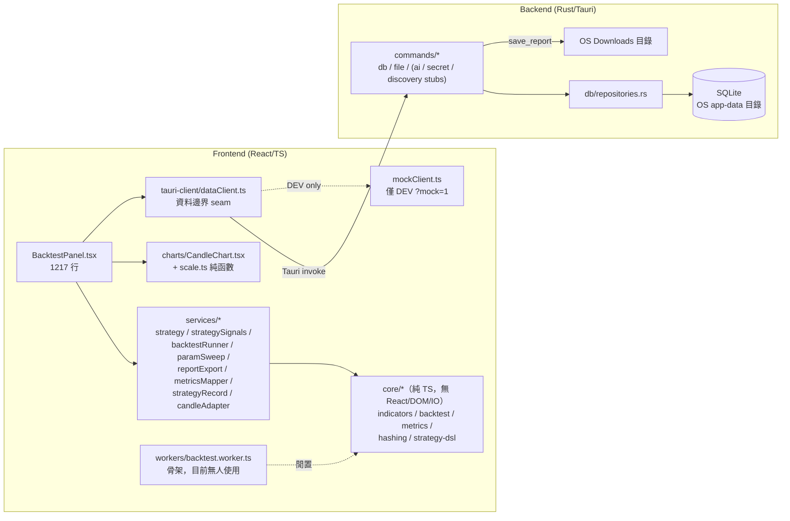

# AlphaFactorForge — Project Audit Masterplan

> 撰寫日期：2026-07-07
> 撰寫角色：Senior Product Architect + Principal Engineer + AI Coding Workflow Strategist
> 性質：**分析與規劃文件，本輪不含任何實作。**
> 執行細節見 [improvement-backlog.md](improvement-backlog.md)；創意功能見 [creative-feature-roadmap.md](creative-feature-roadmap.md)；agent 執行流程見 [agent-execution-protocol.md](agent-execution-protocol.md)。
>
> 審計基準點：branch `fix/button-export-feedback` @ `0d9fe5a`（含一個尚未開 PR 的 commit）；`main` @ `1400812`（PR #25 merged）。

> ### 2026-07-12 更新（審計後已變動）
> 審計（2026-07-07）之後、文件落地之前，PR #26–#31 已合併進 `main`：
> - **Slice 7-3 策略庫 = backlog FEAT-001（PR #27）已完成**——策略庫目前 **inline 在 `BacktestPanel`**（`savedStrategies` 狀態 + `services/strategyLibrary`）。
> - **Slice 10-1/10-2 圖表 wheel-zoom / drag-pan（PR #28 / #29）已完成**（本文件原把 Slice 10 列為 deferred；現已落地）。
> - **Slice 8b 原生圖表視窗（PR #30）已完成**（新增 `components/ChartPopoutWindow.tsx`）。
> - **fix：載入 legacy 策略（PR #31）已完成**。
>
> 連帶影響本審計的量化基準：`BacktestPanel.tsx` 現為 **1362 行 / 43 個 useState**（審計時 1217 / ~30）、`CandleChart.tsx` **491 行**（審計時 379）。因此 **§4 P2（巨石元件）與 §6 R2（拆解 BacktestPanel）的迫切度較審計時更高**，且策略庫為 inline 落地，拆解時應多抽一個 `LibrarySection`。修正後的實際起手順序見 [improvement-backlog.md](improvement-backlog.md) 頂部 2026-07-12 banner（FEAT-001 已移出佇列）。以下 2026-07-07 的分析內容保留為當時快照。

---

## 1. Project Understanding

### 1.1 這個產品要解決什麼問題

AlphaFactorForge 的核心命題不是「又一個回測工具」，而是：

> **散戶/獨立量化研究者最大的敵人是過擬合與資料窺探（data snooping）。這個工作站要讓「自動化搜尋策略」與「不可妥協的驗證紀律」同時成立，並且全部在本機、可重現、可審計。**

證據（來自程式而非 README 口號）：

- `src/core/backtest/index.ts` 明確宣告 deterministic（相同輸入 → 相同輸出），`src/core/hashing/index.ts` 用 canonical JSON + SHA-256 做 `strategy_hash` / `dataset_hash` 去重。
- SQLite schema（`src-tauri/migrations/0001_init.sql`）在 Phase A 就預先立好 `discovery_runs` / `ai_generations`，且 `backtest_summary.segment` 有 `CHECK (train/validation/test/full)`，注釋直接寫「test segment schema exists, but v1 ranking MUST NOT use it」。
- `src/core/strategy-dsl/validator.ts` 是為「AI 只能產生白名單 JSON DSL」設計的安全邊界，含可疑字串掃描。
- UI 文案本身在對抗過擬合：sweep 區塊寫著「歷史最佳常為過度擬合，務必再用樣本外驗證」（`BacktestPanel.tsx:1186`）。

### 1.2 核心使用者是誰

- 明面上（AGENTS.md）：crypto 策略研究者、系統化交易者、需要本機可重現回測的開發者。
- 實際上（**assumption**）：目前唯一活躍使用者是 repo 擁有者本人，工作流是「自己研究策略＋用多個 AI agent 分工開發這個工具」。這代表短期內「AI coding 可接手性」本身就是產品需求的一部分，不只是工程品質議題。

### 1.3 使用者為什麼會回來用

回訪動機取決於「工具裡累積了什麼」：

1. **資料集**：frozen dataset（hash 去重）讓回測可重現 —— 已實作。
2. **策略庫**：可保存、載回、迭代 —— `strategy_def` 已可寫入，但**讀回/管理 UI 尚未存在**（Slice 7-3 未做），這是目前回訪迴路最大的缺口。
3. **驗證結論的累積**：哪些策略通過驗證、哪些被淘汰 —— schema 有 lifecycle（candidate/validated/rejected），UI 完全未呈現。
4. **長時間 discovery 任務**（Phase B）—— 未來的核心黏著點。

### 1.4 目前功能如何支撐目標

Phase A「手動工作流」已經端到端可用（在 Tauri 內）：

```
匯入資料（sample / 貼 JSON）→ SQLite 持久化
→ 策略編輯（params / blocks / code 三模式）
→ 回測（fees/slippage/sizing/SL-TP/fill/direction）
→ Holdout 樣本內外對照
→ 參數掃描熱力圖 + 一鍵套用
→ 圖表（K 線 + overlays + 買賣標記 + replay + hover）
→ 匯出 JSON/CSV 報告
→ 儲存 strategy_def + backtest_summary
```

這條管線的品質（純函數 core、determinism、單元測試 125 個、e2e 14 個）明顯高於一般 prototype，是通往 Phase B（Discovery engine）的正確地基。

### 1.5 功能與目標是否一致 / 哪些偏離主軸

**一致的部分**：holdout、sweep 警語、hash 去重、DSL validator、schema 紀律 —— 全部指向反過擬合主軸。

**偏離或張力點**：

| 現象 | 判斷 |
| --- | --- |
| **參數掃描不吃 holdout 切分**：`BacktestPanel.tsx` 的 `runSweep()` 沒有傳 `from`/`to` 給 `runParamSweep`（引擎本身支援），所以 holdout 開啟時，掃描仍在**全部資料（含樣本外尾段）上最佳化**，之後再用同一段尾巴「驗證」——這正是產品要消滅的資料窺探。 | **與主軸直接矛盾，最高優先修正**（見 backlog BUG-001）。 |
| Slice 8a（浮動面板）、Slice 9（hover crosshair）、按鈕回饋（本 branch）等 UX 加值，先於策略庫（7-3）與資料取得。 | 可理解（都是 user-requested），但注意力已連續三個 slice 花在 chrome 上；核心迴路（策略庫、真實資料）該回到第一位。 |
| Legacy PWA（`AlphaFactorForge.dc.html` + `support.js`）仍留在 repo 根目錄。 | 作為行為參考合理，但只要它還在，AI agent 就有機率誤把它當作要維護的產品（README 的 Known Issues 半數在講 legacy）。需要明確的「唯讀參考」標記。 |
| 真實市場資料進不來：webview CSP `default-src 'self'` 擋掉交易所 fetch，目前只有內建 sample 與手貼 JSON。 | 不是 bug（tasks.md 已記錄），但這是「工具很精緻、卻只能餵玩具資料」的產品級斷點，需要使用者決策資料取得路線（見 Open Questions Q1）。 |

---

## 2. Current System Map

### 2.1 兩層工作區

```
repo 根目錄
├── AlphaFactorForge.dc.html + support.js + manifest.webmanifest   ← legacy 單檔 PWA（唯讀行為參考）
├── README.md / AGENTS.md / tasks.md / TODO.md(在 app 內) / STRATEGY_DISCOVERY.md
│   / STRATEGY_GUIDE.md / HISTORY.md / CONVERSATION_HISTORY.md / handoffs/
└── alpha-factor-forge/                                            ← 實際產品（Tauri v2 + React 18 + TS + Rust + SQLite）
```

### 2.2 主要資料流（現況實作，非規劃）



關鍵事實：

- **回測 / 掃描全部同步跑在 UI thread**（`runSweep` 甚至用 `setTimeout 20ms` 讓「掃描中…」先繪製）。Worker 檔案存在但零引用。
- **持久化只有兩條路**：`import_candles`（datasets+candles）與 `save_strategy`+`save_backtest_result`（summary upsert）。`trades` 表已建但**沒有任何程式寫入**。
- **報告匯出**是唯一的檔案系統出口（`save_report` 寫 Downloads，檔名消毒 + 防覆寫，有 Rust 單元測試）。

### 2.3 主要 UI / state flow

- 單頁應用：`main.tsx`（46 行 shell）→ `BacktestPanel`。沒有 router、沒有全域 store。
- **所有 state（約 30 個 `useState`）都住在 `BacktestPanel`**：datasets、策略草稿、回測結果、holdout、sweep 設定與結果、replay 游標/播放、popout、hover、export 狀態、訊息/錯誤。
- 傳遞方式：render props（`FloatingPanel`）、閉包函數（`renderChart` / `renderMetricsTable`）。目前尚可運作，但下一批功能（策略庫、多分頁、pan/zoom）會逼出 state 重構。

### 2.4 Persistence flow

```
UI → dataClient(seam) → commands.ts(typed invoke) → Rust command → repositories.rs → SQLite (WAL)
```

- Schema 唯一來源：`src-tauri/migrations/0001_init.sql`（9 表 + schema_migrations；migration runner append-only）。
- 三處鏡像必須同步：**SQL 欄位 ↔ Rust DTO（repositories.rs）↔ TS interface（commands.ts）**。這是全 repo 最脆的隱形契約。
- camelCase→snake_case 只允許經 `metricsToBacktestSummary()`（PR #1 定案，已被記錄在多處注釋）。

### 2.5 核心模組責任

| 模組 | 責任 | 純度 |
| --- | --- | --- |
| `core/indicators` | SMA/EMA/WMA/RSI/MACD/ATR/BB/…，warm-up 一律 NaN | 純函數 ✅ |
| `core/backtest` | 訊號 → 成交/部位/權益曲線，deterministic | 純函數 ✅ |
| `core/metrics` | 全部 backtest_summary 指標 | 純函數 ✅ |
| `core/hashing` | canonical JSON + SHA-256（FNV fallback） | 純函數 ✅ |
| `core/strategy-dsl` | AI DSL 白名單 schema + validator（安全邊界） | 純函數 ✅ |
| `services/strategy*` | UI 策略模型、三種模式 → 訊號 | 純函數 ✅ |
| `services/exprInterpreter` | code mode 安全直譯器（tokenizer→parser→AST，無 eval） | 純函數 ✅（安全邊界） |
| `services/paramSweep` | 1–2 參數掃描引擎（cap 64/256） | 純函數 ✅ |
| `services/reportExport` | JSON/CSV 格式器 + 檔名 | 純函數 ✅ |
| `tauri-client/*` | typed invoke 邊界 + mock seam | 邊界層 |
| `components/BacktestPanel` | **其餘一切** | ❌ 巨石 |
| `src-tauri/*` | SQLite、檔案寫入、（B/C stubs） | 邊界層 |

### 2.6 入口檔案與高風險檔案

| 檔案 | 風險 | 原因 |
| --- | --- | --- |
| `src/components/BacktestPanel.tsx` | **最高** | 1217 行、30 個 state、每個 slice 都改它；便宜 agent 的 context 裝不下整檔時最容易砍錯 JSX/漏 state |
| `src/tauri-client/commands.ts` ↔ `src-tauri/src/db/repositories.rs` ↔ `0001_init.sql` | 高 | 三處鏡像；改一處不改其他兩處 = 執行期才爆炸（invoke 參數名是 camelCase，Rust 端 snake_case，靠 Tauri 轉換慣例） |
| `src/tauri-client/dataClient.ts` | 高 | mock seam 的 DEV-only 守衛被弄壞 = mock 進正式版 |
| `src/services/backtestRunner.ts` 的單位轉換 | 高 | legacy percent 慣例（0.05 = 0.05%）→ fraction；改錯一行所有結果悄悄不對 |
| `src/services/exprInterpreter.ts`、`core/strategy-dsl/validator.ts` | 高 | 安全白名單；「幫忙加個功能」就是漏洞來源（有單元測試掃描 eval/Function，需保留） |
| `src-tauri/migrations/0001_init.sql` | 高 | 已套用過的 migration 不可改，只能 append 新檔 |
| `vite.config.ts` / `playwright.config.ts` | 中 | vitest 只收 `src/**`、e2e workers=1（Windows flake 對策）都是刻意設定 |

### 2.7 AI coding agent 最容易誤改的地方（實務清單）

1. 在 component 內 inline metrics→summary 映射（違反 PR #1 決策）。
2. 把 sweep/回測搬到 async 卻破壞 determinism 或測試。
3. 改 `BacktestPanel` 時弄掉某個 `data-testid` → e2e 全紅。
4. 「順手」把 `stoch*` 訊號實作掉，卻沒有先加 core 指標與測試。
5. 動 legacy `AlphaFactorForge.dc.html`（它不是產品）。
6. `npm audit fix --force`（README 明文禁止）。
7. 重建第二份任務板（AGENTS.md 明文禁止；本次新增的 `docs/improvement-backlog.md` 是「規格庫」，任務狀態仍記在 `tasks.md`，見該文件開頭聲明）。

---

## 3. Strengths

| # | 優點 | 位置 | 為什麼是優點 | 如何保留 |
| --- | --- | --- | --- | --- |
| S1 | **core/* 純函數層完全乾淨** | `src/core/*` | 無 React/DOM/IO 依賴、deterministic、warm-up NaN 慣例一致；未來 Rust 移植或 Worker 化零阻力 | 任何 PR 不得在 core 引入 IO/DOM；維持「新指標必附單元測試」規則 |
| S2 | **分層紀律 + 單一映射點** | `services/metricsMapper.ts`、`candleAdapter.ts`、`strategyRecord.ts` | 欄位映射、單位轉換、hash 計算各只有一個家；注釋直接引用 PR 決策，agent 可考古 | code review 檢查點：任何 inline 映射一律退回 |
| S3 | **安全邊界是真的做了，不是口號** | `exprInterpreter.ts`（無 eval、node/depth caps、有測試掃描原始碼）、`strategy-dsl/validator.ts`（白名單+可疑字串）、`file_commands.rs`（檔名消毒+防覆寫）、CSP、鍵值不落地規則 | 白名單擴充必須 schema+validator+測試三件套一起動；保留「掃描原始碼防 eval」的測試 |
| S4 | **測試金字塔成形** | Vitest 125（core+services）、Playwright 14（mock seam）、Rust `cargo test`（repo+檔名）、CI 5 jobs | 每個 slice 都帶著測試證據合併（tasks.md 有全程記錄）；mock seam 讓 UI 回歸不需要 Tauri | e2e 新 flow 一次一個 PR；mock 永遠 DEV-only |
| S5 | **交接文化與可考古性** | `AGENTS.md`（協作契約）、`tasks.md`（slice 級驗收記錄）、`handoffs/`（append-only 決策記錄）、檔頭注釋標 FULL/SKELETON/STUB | 這是罕見的「為 AI 多代理協作設計過的 repo」；新 agent 可以不靠聊天記憶接手 | 本次四份 docs 納入同一體系；狀態類資訊集中化（見 P4） |
| S6 | **Rust 端小而正確** | `db/mod.rs`（migration runner）、`repositories.rs`（upsert 語義有測試記錄）、`error.rs` | 沒有過度設計；Mutex 單連線在 Phase A 足夠且注釋已標明 Phase B 換 pool | Phase B 前不要提前抽象 |
| S7 | **UI 行為對齊 legacy 有據可查** | `backtestRunner.ts` 注釋逐條對照 legacy 公式、`paramSweep.ts` 對照 runSweep caps | 移植不是憑感覺，單位/clamp/上限都可回溯 | 引擎行為變更必須引用 legacy 對照或明確標記「刻意偏離」 |

---

## 4. Problems / Weaknesses

> Severity 定義：Critical＝正在造成錯誤結論或安全風險；High＝阻礙產品核心價值或即將造成工程事故；Medium＝持續拖慢速度/累積風險；Low＝清潔度問題。

### P1 — 參數掃描無視 Holdout 切分（反過擬合紀律破口）

- **Problem**：holdout 開啟時，sweep 仍在全期資料（含樣本外尾段）上找最佳參數。
- **Evidence**：`BacktestPanel.tsx` `runSweep()` 呼叫 `runParamSweep({ candles, strat, interval, sweep })`，未傳 `from`/`to`；而 `paramSweep.ts` 明確支援 `from`/`to` 且注釋寫著「e.g. sweep in-sample only」。
- **Affected files**：`src/components/BacktestPanel.tsx`（呼叫端）；`src/services/paramSweep.ts`（無需改）。
- **Why it matters**：產品的存在理由就是防資料窺探；現在的 UI 流程（掃描→套用最佳→開 holdout 驗證）恰好在教使用者用「已被最佳化污染的樣本外」自我欺騙。
- **User impact**：得到虛高的 OOS 成績，做出錯誤的策略信任判斷。
- **Engineering impact**：修正本身極小（傳兩個參數＋UI 標示）；拖越久，越多既存結論作廢。
- **AI-coding risk**：低——引擎已支援，屬呼叫端接線。
- **Severity**：**High**（從產品目標看接近 Critical，但它不會弄壞資料，只會誤導判讀）。
- **Suggested direction**：holdout 開啟時 sweep 只跑樣本內 `[0, split-1]`，熱力圖標題標示「僅樣本內」；holdout 關閉時維持全期。→ backlog **BUG-001**。

### P2 — `BacktestPanel.tsx` 巨石元件

- **Problem**：單檔 1217 行、約 30 個 `useState`、10+ 個內嵌子元件與 helper，承載資料集管理、三模式策略編輯、執行模型、holdout、回測、掃描、replay、popout、hover、匯出、儲存與全部樣式。
- **Evidence**：`wc -l` = 1217；檔案內同時定義 `RuleRows`/`CodeField`/`NumberInput`/`AxisEditor`/`SweepHeatmap`/`PoppedOutNote` 與樣式常數 `S`。
- **Affected files**：`src/components/BacktestPanel.tsx`。
- **Why it matters**：這是所有 slice 的必經之地。Slice 7-3（策略庫）、Slice 10（pan/zoom）都還要再往裡加東西。
- **User impact**：間接——迭代變慢、regression 機率上升。
- **Engineering impact**：合併衝突集中地；任何人改任何功能都要 diff 這一檔。
- **AI-coding risk**：**最高**。便宜 agent 讀不完整檔就動手 → 刪錯 state、漏 `data-testid`、重複宣告；review 也難聚焦。
- **Severity**：**High**。
- **Suggested direction**：機械式抽檔（不改行為、不改 DOM 結構、testid 全保留）：先 sweep 區塊 → 再 chart/replay 區塊 → 再 dataset/export。State 暫時留在 panel 用 props 下傳，等抽完再評估 store。→ backlog **REF-001 ~ REF-003**。

### P3 — 回測/掃描同步佔用 UI thread，Worker 閒置

- **Problem**：最多 256 次回測的掃描在 click handler 內同步執行；`backtest.worker.ts` 有完整協定骨架但無人使用。
- **Evidence**：`runSweep()` 內的 `await new Promise(r => setTimeout(r, 20))` 注釋自述「Let 掃描中… paint before the (synchronous...) run」；`grep backtest.worker` 無任何 import。
- **Affected files**：`BacktestPanel.tsx`、`workers/backtest.worker.ts`、`services/paramSweep.ts`。
- **Why it matters**：sample 600 根沒感覺；真實資料 5000+ 根 × 256 組合會凍結 UI 數秒到數十秒，而「大資料集」正是產品要走的方向。
- **User impact**：介面凍結、無法取消掃描。
- **Engineering impact**：Phase B 的 discovery 在 Rust 跑，但互動級掃描本來就規劃在 Worker（spec §13）；越晚接，panel 內同步假設越多。
- **AI-coding risk**：中——搬 Worker 涉及訊息協定與 React 生命週期，便宜 agent 容易做出 race condition；需要清楚的任務規格。
- **Severity**：**Medium**（資料量小時無感）→ 資料閘門打開後升 High。
- **Suggested direction**：先 sweep 後單次回測；沿用 worker 現有 jobId 協定，加 cancel。→ backlog **PERF-001**。

### P4 — 專案狀態文件發散且互相矛盾

- **Problem**：狀態類敘述散落在 README（三語 × 各一份）、AGENTS.md §0.1、TODO.md、PHASE_A_VERIFY.md、tasks.md、HISTORY.md，多處已過時且互相矛盾。
- **Evidence**：README 說「npm test: 3 files, 25 tests」「rustc/cargo 不在 PATH、native Tauri 未驗證」；tasks.md 說「125 tests、cargo tauri dev 通過、Rust 1.96 已安裝」。AGENTS.md §0.1 說「The folder is not currently a valid Git repository」——但 repo 已有 26 個 merged PR。
- **Affected files**：`README.md`、`AGENTS.md`、`alpha-factor-forge/TODO.md`。
- **Why it matters**：這個 repo 的協作模式就是「agent 先讀文件再動手」；過時文件會直接變成錯誤行為（例如 agent 以為 Rust 環境不存在而跳過 cargo 驗證）。
- **User impact**：無直接影響。
- **Engineering impact**：每個新 session 浪費 token 消化矛盾、可能做出錯誤前提的計畫。
- **AI-coding risk**：**High**——這是「AI 可接手性」的第一殺手。
- **Severity**：**Medium**（工程），對 AI workflow 而言 High。
- **Suggested direction**：單一事實來源原則：狀態只活在 `tasks.md` Current Snapshot；README/AGENTS 改為指向它並修正已知錯誤敘述；三語 README 的狀態段落縮成一份。→ backlog **DOC-001**。

### P5 — 沒有 lint / format 工具鏈

- **Problem**：只有 `tsc --noEmit` 守門；無 ESLint、無 Prettier、無 rustfmt/clippy gate。
- **Evidence**：`package.json` devDependencies 無任何 lint 套件；CI 無 lint job；`BacktestPanel.tsx:289` 手寫 `// eslint-disable-line` 但根本沒有 ESLint 在跑。
- **Affected files**：`package.json`、`.github/workflows/ci.yml`（未來）。
- **Why it matters**：多 agent 協作時，風格與慣例的機械化守門是最便宜的品質槓桿；沒有它，reviewer 得人肉抓 unused import、hooks 依賴錯誤。
- **AI-coding risk**：Medium——便宜 agent 特別依賴 lint 即時回饋。
- **Severity**：**Medium**。
- **Suggested direction**：引入 ESLint（typescript + react-hooks 插件）+ Prettier，先 warn 後 error，CI 加 job。**需要新 devDependencies → 需使用者核准**（Open Questions Q3）。→ backlog **TEST-003**。

### P6 — 交易明細（trades 表）從未持久化

- **Problem**：儲存結果只寫 `backtest_summary`；`trades` 表空置。JSON 報告裡有完整 trades，但資料庫裡沒有。
- **Evidence**：`db_commands.rs` 注釋「Trade-level detail (the `trades` table) is deferred to the UI port」；前端無任何 `save_trades` 呼叫；schema 中 `trades` 表完整存在。
- **Affected files**：`repositories.rs`、`db_commands.rs`、`commands.ts`、`BacktestPanel.tsx`（save 流程）。
- **Why it matters**：沒有 trade 明細就無法做事後過擬合檢查（STRATEGY_DISCOVERY「三層持久化」的第三層）、無法回放歷史 run 的買賣點、未來 Results Explorer 沒料可看。
- **Severity**：**Medium**。
- **Suggested direction**：`save_backtest_result` 擴充為 summary + trades 同交易寫入（replace-on-upsert）。→ backlog **FEAT-002**。

### P7 — 真實資料取得斷點

- **Problem**：產品目前只能吃內建 sample 或手貼 JSON；交易所 fetch 被 CSP 擋（刻意），backend fetch command 不存在，也沒有檔案匯入 dialog。
- **Evidence**：`tauri.conf.json` CSP `default-src 'self'`；tasks.md 明載「Data must arrive via import (file/JSON) or a future backend fetch command」；`sampleData.ts` 注釋自述「NOT for evaluation」。
- **Why it matters**：所有精緻的驗證功能都在玩具資料上空轉；這是使用者價值的第一瓶頸。
- **Engineering impact**：backend fetch 需要 `reqwest`（Cargo.toml 已預留注釋但屬新依賴）；CSV 檔案匯入需要 dialog 能力（Tauri v2 需 plugin 或 Rust 端 rfd）。兩條路都動到依賴。
- **AI-coding risk**：Medium-High（網路、rate limit、錯誤處理、資料清洗）。
- **Severity**：**High**（產品層）。
- **Suggested direction**：先做零依賴的過渡（Rust 端讀本機 CSV/JSON 路徑 command），交易所 fetch 列為需核准的正式任務。→ Open Questions **Q1**、backlog **FEAT-003**。

### P8 — `insert_strategy` UPSERT 不更新可變欄位

- **Problem**：同 hash 再儲存只更新 `updated_at`，name/lifecycle/source 的變更會被默默丟棄。
- **Evidence**：tasks.md Backlog 已記錄；`repositories::tests::insert_strategy_upserts_on_hash_without_duplicating` 文件化了現狀。
- **Severity**：**Low**（hash 覆蓋全定義，僅改名時才踩到）。
- **Suggested direction**：與 Slice 7-3 策略庫一起定語義（改名應可持久化）。→ backlog **REF-004**。

### P9 — 錯誤處理與 UI 韌性薄弱

- **Problem**：(a) 全 app 無 React error boundary，任何 render 例外 = 白屏；(b) 錯誤一律 `String(e)` 塞進同一條紅色訊息列，無分類、無 retry 提示；(c) `db.init()` 失敗只顯示在 header 狀態字串。
- **Evidence**：`main.tsx`、`BacktestPanel.tsx` 各 catch 點。
- **Severity**：**Low-Medium**（單人桌面工具可容忍，但 debug 成本高）。
- **Suggested direction**：加一個頂層 error boundary + 錯誤訊息保留原文但標注操作來源。→ backlog **UX-002**。

### P10 — 引擎細節與 legacy 的一致性未經稽核

- **Problem**：`core/backtest` 有幾個值得盤點的行為：`nextOpen` 模式下 exit 成交價取次根開盤但 `exitTime` 記當根時間；SL/TP 觸發價不套 slippage；short 的保證金記帳走「reserve collateral」模型；`close()` 內有已 void 的死變數（`raw`/`buyToClose`）。這些可能是刻意簡化，也可能是移植偏差——目前沒有文件說是哪一種。
- **Evidence**：`src/core/backtest/index.ts:96-137`。
- **Why it matters**：回測正確性是 AGENTS.md 列名的 high-risk area；「不知道是否正確」本身就是風險。
- **AI-coding risk**：High——agent 看到死變數會「順手清理」，看到不一致會「順手修正」，兩者都可能改變全部歷史結果。
- **Severity**：**Medium**。
- **Suggested direction**：先寫「行為固定測試」（golden tests）鎖住現狀，再逐項與 legacy 對照做出「保留/修正」的書面決策。修正屬行為變更，需 maintainer 簽核。→ backlog **TEST-002**。

### P11 — mock 與真後端的契約漂移風險

- **Problem**：`mockClient.ts` 手工模擬 9 個 command 的行為（例如 import 直接 push、無 upsert 語義），e2e 綠不代表 Tauri 路徑對。
- **Evidence**：mock 的 `importCandles` 不做 dataset_hash 去重；真後端 `insert_dataset` 是 ON CONFLICT upsert。
- **Severity**：**Low-Medium**（目前已用「Rust integration tests + tauri dev smoke」明文補位）。
- **Suggested direction**：維持現狀但把「mock 已知偏差」列表寫進 mockClient 檔頭；重大 command 行為變更時同步 mock。不建議建 contract-test 框架（過度工程）。→ backlog **DOC-002** 附帶項。

### P12 — 工作區雜物與環境風險

- **Problem**：(a) repo 位於 OneDrive 同步資料夾（`桌面/AlphaFactorForge`），node_modules / target / SQLite WAL 與同步機制互咬，是 Windows 上常見的 corruption/效能來源；(b) 未追蹤雜物堆在根目錄（`區塊鏈交易策略PWA.zip` 381KB、`tauri-dev-smoke*.log`、`.thumbnail`、`.vite/`、`AlphaFactorForge.dc.html` 的 169KB 已被 commit）；(c) `Canvas.dc.html`、`support.js` 是 legacy runtime，與產品無關但在 repo 根。
- **Evidence**：根目錄 listing；`git ls-files`。
- **Severity**：**Low**（但 OneDrive 項目若咬到 `.git` 會瞬間變 Critical——**assumption**：目前尚未發生）。
- **Suggested direction**：短期在 `.gitignore` 與文件標注；遷移 repo 出 OneDrive 屬使用者決策。→ Open Questions **Q5**、backlog **DOC-002**。

### P13 — 已知次要問題（彙整）

| 項 | 現象 | Severity |
| --- | --- | --- |
| npm audit 5 vulnerabilities（README 記錄），未分類 | 供應鏈 | Low-Medium（需盤點但禁 `--force`）→ **SEC-001** |
| code mode 表達式非法時 Run 鈕仍可按（tasks.md 已記錄為 polish） | UX | Low |
| `stochOversold/stochOverbought` 出現在型別與 UI 標籤（標「未支援」）但點了會 throw | UX | Low（有防護，體驗粗糙） |
| e2e 僅 chromium、僅 mock 模式 | 測試盲區 | Low（已知且文件化） |
| UI 字串硬編碼 zh-TW 散落 JSX | i18n | Low（單人使用，暫不處理） |
| inline style 為主、`styles.css` 只有按鈕回饋 | 一致性 | Low（重構時順勢集中，勿獨立大改） |

---

## 5. Opportunity Areas

| 方向 | 現況 | 改善機會 | 預期收益 | 成本 | 風險 | 值得做？ |
| --- | --- | --- | --- | --- | --- | --- |
| **Product value** | 管線精緻但只有玩具資料；驗證紀律有破口（P1） | BUG-001 補紀律；FEAT-003 打開本機檔案資料入口 | 工具從 demo 變成真的可用 | S（BUG-001）+ M（FEAT-003） | 低 | ✅ 最優先 |
| **User retention** | 存進 DB 的東西讀不回來（無策略庫、無歷史 run 檢視） | Slice 7-3 策略庫；其後 run history | 「累積感」= 回訪動機 | M | 低 | ✅ 高 |
| **UX clarity** | 單頁塞滿八個功能區；HelpTip 已緩解學習曲線 | 抽元件後自然分區；error boundary；code-mode run 防呆 | 中 | S-M | 低 | ✅（隨 REF 順勢） |
| **Engineering quality** | core 優秀、UI 層巨石、無 lint | REF-001~003 拆檔；lint 工具鏈 | 迭代速度與 review 品質 | M | 低（機械式拆分） | ✅ 高 |
| **Performance** | 同步掃描；600 根無感 | Worker 化 + 取消；資料量大後才痛 | 中 | M | 中（併發） | ⏳ 排在資料入口之後 |
| **Reliability** | determinism 佳；引擎細節未稽核（P10）；trades 不落地（P6） | golden tests + 引擎決策文件；trades 持久化 | 對結果的信任 | S-M | 低 | ✅ |
| **Maintainability** | 文件多但狀態發散（P4） | 單一事實來源 + stale 修正 | 每個 agent session 省下的認知稅 | S | 極低 | ✅ 立刻 |
| **Monetization / growth** | 個人工具，無商業化跡象 | （**assumption**：非目標）可分享的報告/圖卡是最低成本的傳播面 | 低-中 | S-M | 低 | ⏳ 見 creative roadmap |
| **AI coding scalability** | AGENTS.md/handoffs 已是強項；巨石檔與髒文件是兩大阻力 | 本次四文件 + REF + DOC-001 | 便宜 agent 可安全接手的任務面擴大 3-5 倍 | S-M | 低 | ✅ 本審計的主目的 |

---

## 6. Strategic Recommendation（Top 5，依 ROI 排序）

### R1 — 修補驗證紀律：sweep 尊重 holdout（backlog BUG-001）

- **Why this matters**：這是產品核心承諾與實際行為唯一直接矛盾的點。
- **Expected impact**：使用者在 holdout 模式下得到真正乾淨的樣本外驗證；產品敘事誠實。
- **Effort**：**S**（呼叫端傳 `from`/`to` + UI 標示 + e2e 斷言）。
- **Risk level**：低（引擎已支援並有單元測試）。
- **Dependency**：無。
- **Suggested phase**：立即，第一個任務。
- **What not to do**：不要動 `paramSweep.ts` 引擎；不要順手做 walk-forward。
- **Acceptance criteria**：holdout 開啟時掃描僅用樣本內 bars；熱力圖標題顯示範圍；holdout 關閉行為不變；新 e2e 通過；125+ 既有測試綠。

### R2 — 分三步拆解 `BacktestPanel`（backlog REF-001 ~ REF-003）

- **Why this matters**：解除所有後續 slice 的單點瓶頸；把「便宜 agent 可安全執行」從小修變成功能開發。
- **Expected impact**：單檔降到 <400 行/檔；merge conflict 域縮小；review 可聚焦。
- **Effort**：**M**（每步 S-M，機械式、零行為變更）。
- **Risk level**：中——靠「testid 全保留 + e2e 全綠 + 禁止順手改」壓到低。
- **Dependency**：R1 先合（避免同檔衝突）。
- **Suggested phase**：Phase 1（本月）。
- **What not to do**：不引入狀態管理套件；不改 DOM 結構與樣式；不重新命名 state；一步一 PR。
- **Acceptance criteria**：三步各自 typecheck/test/build/e2e 全綠；`git diff` 顯示為搬移而非重寫；BacktestPanel 最終 <400 行。

### R3 — 完成 Slice 7-3 策略庫（backlog FEAT-001）

- **Why this matters**：這是 tasks.md 既定的下一步，也是回訪迴路（存→取→迭代）的閉環點；`get_strategies` command 與 Rust 端都已存在。
- **Expected impact**：使用者的策略資產第一次「看得見、拿得回」。
- **Effort**：**M**。
- **Risk level**：低-中（需處理 `original_definition_json` 反序列化與版本容錯）。
- **Dependency**：建議在 REF-001（sweep 抽離）之後做，避免再往巨石裡加區塊；可與 REF-002/003 並行。
- **Suggested phase**：Phase 1-2。
- **What not to do**：不做編輯/分類/標籤等進階管理；先 list + load + delete。
- **Acceptance criteria**：可列出已存策略、載回表單（三模式皆可）、刪除；壞 JSON 有容錯提示；e2e 覆蓋 list/load。

### R4 — 文件狀態單一事實來源（backlog DOC-001）

- **Why this matters**：AI 協作 repo 的文件就是程式；現在它有已知的假敘述（P4）。
- **Expected impact**：每個 agent session 的啟動成本與錯誤前提大幅下降。
- **Effort**：**S**。
- **Risk level**：極低（純文件）。
- **Dependency**：無；可最先做。
- **Suggested phase**：立即（可與 R1 同批）。
- **What not to do**：不重寫整份 README；不動三語結構；只修狀態段與明確錯誤。
- **Acceptance criteria**：README/AGENTS 不再含已證偽敘述；狀態只在 tasks.md 維護；其他文件以連結指向。

### R5 — trades 持久化 + 引擎 golden tests（backlog FEAT-002 + TEST-002）

- **Why this matters**：補齊「三層持久化」的第三層，並在任何人動引擎前把現行為鎖進測試（P6+P10 一起收）。
- **Expected impact**：歷史 run 可事後審計；引擎重構/修正有安全網。
- **Effort**:**M**（兩個獨立 S-M 任務）。
- **Risk level**：低。
- **Dependency**：TEST-002 應先於任何引擎行為修正；FEAT-002 無依賴。
- **Suggested phase**：Phase 2。
- **What not to do**：TEST-002 只鎖現狀不修行為；FEAT-002 不動 summary upsert 語義。
- **Acceptance criteria**：見 backlog 各任務。

> 落選說明：Worker 化（PERF-001）與資料入口（FEAT-003）價值都高，但前者在玩具資料下無感、後者需要使用者先決策路線（Q1）與新依賴核准，故列 Phase 2/3 與 Open Questions，不佔 Top 5 執行位。

---

## 7. Do Not Touch List

| Area | Reason | Risk if changed now | When to revisit |
| --- | --- | --- | --- |
| `core/backtest` 的計算行為（含看似可刪的死變數） | 全部歷史結果的可比性依賴它；不一致點尚未做成書面決策 | 所有已存 summary 與 e2e 預期悄悄失效 | TEST-002 golden tests 合併後，逐項附決策修改 |
| `src-tauri/migrations/0001_init.sql` | migration runner append-only；已套用於使用者 DB | 既有 DB 與新 schema 分叉、啟動失敗 | 永不改舊檔；需要變更就加 `0002_*.sql` |
| `exprInterpreter.ts` / `strategy-dsl` 白名單與上限 | 安全邊界；有測試防 eval | 打開任意程式碼執行面 | Phase C 設計評審時整體審 |
| `dataClient.ts` mock seam 的 `import.meta.env.DEV` 守衛 | mock 進 production = 假資料假儲存 | 資料默默不落地 | 不需 revisit；只能加測試 |
| `playwright.config.ts` `workers: 1` 與 `vite.config.ts` test include 範圍 | Windows 本機 flake 對策、vitest/e2e 隔離，皆為踩坑後的刻意設定 | 本機 e2e 隨機紅 | e2e 套件變大且遷出 Windows 本機瓶頸後 |
| `tauri.conf.json` CSP 與 identifier | 安全邊界＋app-data 路徑綁定 | XSS 面擴大；identifier 改動 = 使用者資料「消失」 | 交易所 fetch 決策（Q1）走 backend，不放寬 CSP |
| 依賴版本（含 `npm audit fix --force` 禁令） | README 明文；Vite/Tauri 相容性未驗 | build 全紅 | SEC-001 盤點後逐項升級 |
| Legacy `AlphaFactorForge.dc.html` / `support.js` / `Canvas.dc.html` | 唯讀行為參考 | 浪費工時維護將death的程式；與產品混淆 | 移植完成後歸檔（Q4） |
| `tasks.md` 的任務板地位 | AGENTS.md 契約：唯一任務板 | 兩份板子分叉 | 不 revisit |

---

## 8. Open Questions（需使用者決策）

### Q1 — 真實市場資料的取得路線？

- **Why it matters**：這是產品價值第一瓶頸（P7），且兩條路都涉及新依賴/能力。
- **Options**：
  - A. 本機檔案匯入優先：Rust command 讀使用者指定路徑的 CSV/JSON（零新依賴，資料自備）。
  - B. Backend 交易所 fetch：`reqwest` + rate limit + 資料清洗（新依賴 `reqwest`/`tokio`，Cargo.toml 已預留注釋）。
  - C. 兩者都做，A 先 B 後。
- **Recommended**：**C**（A 立即可排＝FEAT-003；B 另立任務，等你核准依賴後排入）。
- **Consequence if ignored**：所有驗證功能持續只能跑合成資料，工具價值封頂。

### Q2 — 引擎與 legacy 的不一致（P10）要「對齊 legacy」還是「文件化為刻意偏離」？

- **Why it matters**：決定 TEST-002 之後是否跟著行為修正任務；影響所有歷史結果可比性。
- **Options**：A. 對齊 legacy 語義；B. 保留現行為並在文件明載差異；C. 逐項裁決（SL/TP 滑價、nextOpen exitTime 等各自決定）。
- **Recommended**：**C**，以 TEST-002 的對照報告為裁決輸入。
- **Consequence if ignored**：每個接手 agent 都會重新「發現」這些點並想修，反覆消耗。

### Q3 — 是否核准加入 ESLint + Prettier（新 devDependencies）？

- **Why it matters**：本輪禁裝套件；lint 是多 agent 品質守門最高 ROI 工具，但必須你點頭。
- **Options**：A. 核准（建議 eslint + typescript-eslint + react-hooks + prettier）；B. 暫不加，靠 review。
- **Recommended**：**A**。
- **Consequence if ignored**：便宜 agent 產出的風格漂移由人工 review 吸收。

### Q4 — Legacy PWA 三件套（dc.html/support.js/Canvas.dc.html）的去留時點？

- **Why it matters**：169KB+ 的已 commit 參考物持續出現在 grep/context，誤導 agent（P12c）。
- **Options**：A. 現在移到 `legacy/` 子目錄並在 README 標唯讀；B. 移植全部完成後再歸檔；C. 直接刪除（git 歷史仍可找回）。
- **Recommended**：**A**（純搬移 + 連結修正，低風險）。
- **Consequence if ignored**：agent 誤改機率與 context 汙染持續存在。

### Q5 — Repo 是否遷出 OneDrive 同步路徑？

- **Why it matters**：OneDrive 與 `.git`/node_modules/SQLite WAL 的互動是已知 corruption 與效能風險（P12a）。
- **Options**：A. 遷到本機非同步路徑（如 `C:\dev\AlphaFactorForge`），OneDrive 留 clone；B. 對資料夾設定「永遠保留在此裝置＋排除同步」；C. 維持現狀。
- **Recommended**：**A**。
- **Consequence if ignored**：低機率、高傷害的 `.git` 損毀持續存在（**assumption**：尚未發生過）。

### Q6 — npm audit 的 5 個 vulnerabilities 何時處理？

- **Why it matters**：懸掛的安全警示會讓每次 `npm install` 都產生「要不要修」的決策噪音。
- **Options**：A. 排 SEC-001 盤點（只分類與升級相容項，不 `--force`）；B. 等 Vite/Tauri 大版本升級時一併處理。
- **Recommended**：**A**（S 級任務，產出報告再決定升級）。
- **Consequence if ignored**：某個 agent 終究會忍不住 `npm audit fix --force` 弄壞 build（README 已預言這件事）。
