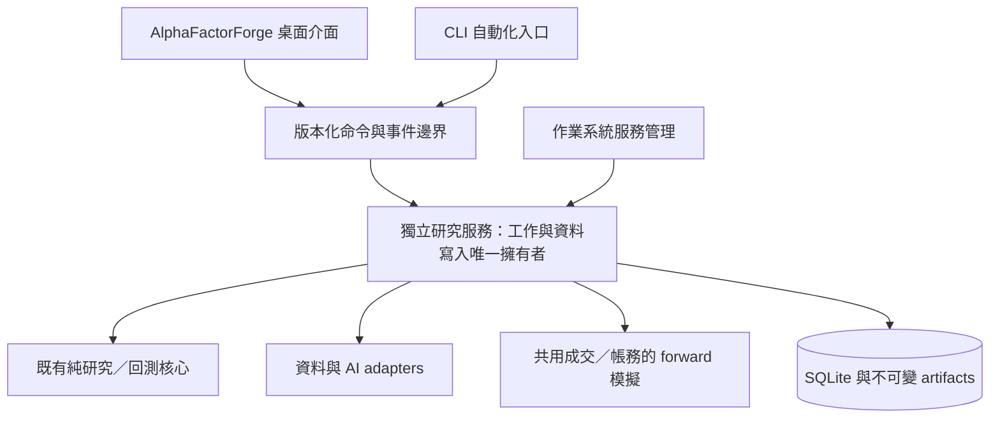

# Handoff: AlphaBTC 能力承接與有介面的持續研究服務

Date: 2026-09-15
Repo: yoyoCadence/AlphaFactorForge
Branch: docs/alphabtc-capability-transfer
Status: 能力清單與實作規格已交付；功能尚未移植，服務拆分為待實作提案

## Summary

使用者指出：有介面的 AlphaFactorForge 與無介面、全天候研究服務並不衝突。採納此需求修正：產品應能以桌面介面管理同一套持續研究服務，也能在沒有介面的環境執行。是否有 UI 不作為放棄任一專案能力的理由。

本次把 AlphaBTC 可保留的特點整理為 AlphaFactorForge 可接手的實作清單。這份文件是能力／驗收規格，`tasks.md` 仍為唯一任務板；沒有把「可移植」標為「已實作」。既有 TypeScript/Rust 回測與資料契約要保留，差異經版本化決策處理，不整份搬入另一套引擎或資料庫。

基準與範圍：

- AlphaBTC：本機 `58b1683`（引擎基準沿用 `c716d2a`），來源路徑 `C:\Users\memor\OneDrive\桌面\AlphaBTC`。
- AlphaFactorForge：先檢查 `fix/atomic-report-filenames`／`beef407`，文件分支從本機已知 `origin/main`／`e3fc79f` 建立；這兩個提交的相關 runner／研究架構一致。原功能分支與提交保留。
- `git fetch origin` 回傳 GitHub authentication failed，沒有成功確認最新遠端 main。本地文件可以審查，發布前仍需重新同步、比對差異。未將舊遠端基準冒稱最新。
- 本輪只修改本文件及 `tasks.md`。沒有安裝服務、執行研究／AI、讀寫研究或模擬帳戶 DB、搬移資料、修改引擎或驗證門檻。

## 1. 產品需求與現況差異

應支援三種操作情境，使用相同研究與帳務核心：

1. 本機桌面：以 AlphaFactorForge UI 設定、啟停、查詢研究；關閉 UI 可依明確設定讓服務繼續。
2. 無介面服務：不啟動 WebView，也能排程、回測、記錄與前瞻模擬；CLI 查詢／控制同一服務。
3. UI 重新連接：顯示服務內既有計畫、進度、帳戶與歷史，不能再次建立或重跑同一工作。遠端機器上的服務日後可透過受控連線管理；不預設公開 HTTP 端點。

**兩個專案都尚未達成完整的 24/7 自動 AI 研究。** AlphaBTC 的 CLI／HTTP 共用 application services 與 paper watch 是可沿用的分層經驗，不等於已有完整研究排程、作業系統服務或長期運行證據。

AlphaFactorForge 的 `src-tauri/src/main.rs` 目前在 Tauri setup 開啟 DB、建立 `DiscoveryRunner` 並修復孤兒工作；runner 工作由該應用程式程序持有。`discovery_runner/mod.rs` 有 `DiscoveryEventSink` 邊界可利用，但仍含 `AppHandle`／Tauri sink；`lib.rs` 刻意只暴露純 `discovery_core`。因此可沿既有分層拆出獨立的執行宿主，不能宣稱今天關掉整個桌面程序後還會計算。

隱藏視窗、退出 UI、停止服務、取消研究、風控停止是不同操作。UI 要讓使用者明確區分；關機或服務宿主休眠時不會繼續計算，恢復後只能補排工作與記錄資料空窗，不能虛構期間內的前瞻成交。

## 2. AlphaBTC 能力清單與承接方式

以下 AlphaBTC 路徑相對其 repository 根目錄；AlphaFactorForge 的 `src/`、`src-tauri/` 路徑相對 `alpha-factor-forge/`。標記「擴充」表示目標專案已有相關能力，應補差異而非重建。

| ID／特點 | AlphaBTC 實際依據與界線 | AlphaFactorForge 承接方式與驗收重點 |
|---|---|---|
| C01 共用 CLI／UI use cases | `application.ts`、`cli.ts`、`server.ts`；展示層不計算量化／帳務 | **擴充**：CLI、桌面 adapter 呼叫相同 application runtime。相同輸入產生相同研究結果，UI 退出不結束獨立服務 |
| C02 原始行情證據與修訂追蹤 | `exchange.ts`、`audit.ts`、`store.ts` 保存原回應、抓取時間、hash、缺漏與修訂差異；失敗仍保留 | **擴充 DATA-QUALITY-001／PARITY-002**：不可只剩匯入後 candles。品質拒絕也有可重播原件，修訂不能靜默覆蓋 |
| C03 明確經濟時序與市場識別 | `domain.ts`、`data.ts` 的 start／seconds／availableAt、retrievedAt、source、rawHashes；歷史可用性標示假設 | **擴充 dataset 契約**：場所、base／quote、現貨類型、收盤／可用／觀測時間與時間單位分開。USDT 不改名 USD；歷史重新下載不冒稱 point-in-time 資料 |
| C04 不可變快照與合成證據隔離 | `makeDataset()`、application 凍結結果與 synthetic 標記 | **已有 hash／immutable import，補語意**：demo、真實歷史、前瞻觀察分開；缺口、未收盤、對不齊商品網格不能成為合格資料 |
| C05 經濟假說先登記 | `hypotheses.ts` 保存 mechanism、counterparties、signal、failureModes、limitations、revision、digest | **新增到候選登記**：AI 先說明為何可能有效、何時失效、需要哪些資料，再回測。假說與 DSL／父候選凍結，不在看完結果後改寫原理由 |
| C06 因果成交與流動性限制 | `backtest.ts`、`execution.ts` 延遲目標、部分成交、量能上限、最小單量、數量／價格步進、費用／spread／slippage／impact | **擴充既有成交契約**：先用兩引擎固定案例比較差異。不能直接把 AlphaBTC 的額外一根延遲取代既有 fill mode；新模式要版本化。未來行情變更不得影響過去訊號／訂單 |
| C07 回測與前瞻共用帳務 | `execution.ts`、`paper.ts` 共用成交、費用、現金、庫存、成本與內部帳本重播 | **新增 forward 模式並沿用目標核心**：相同受控成交事件，在 historical／forward 模式得到相同帳務；內部對帳不宣稱是交易所外部對帳 |
| C08 多資產曝險與降風險 | `risk.ts` 在單策略 BTC／ETH 內用 covariance、vol scaling、商品／總額上限；只縮小曝險 | **承接多資產待辦**：記錄組合權重與共同現金。不將獨立帳戶相加當成共享投資組合；多策略 allocator 在兩邊都未完成 |
| C09 持久風控鎖定 | `risk.ts`、`paper.ts` 的日損失、drawdown、jump、stale／future／crossed quote、spread、kill；checkpoint 保存狀態 | **新增 paper 風控契約**：跨日／重啟仍保留風控狀態；行情失效拒絕成交，恢復時依鎖定狀態僅減倉；不自動解除 kill。殘倉仍列出，不把零目標當已平倉 |
| C10 定期退化審查 | `risk.ts review()`、historical supervisor：最小樣本、審查頻率、降額幅度、冷卻期 | **可採用為有標記的風控規則**：同一節奏在歷史與 forward 可重現；目前只是啟發式降額，不是已驗證的統計退化／regime detector 或自動學習 |
| C11 滾動樣本外與成本壓力 | `statistics.ts`、`research.ts`：purged folds、paired excess、block bootstrap、Holm、雙倍成本、鄰近參數 | **擴充現有 split/Gate**：凍結研究協定，增加 walk-forward 與穩健性診斷，保留每區段失敗。先修試驗計數／抽樣精度，再移植檢定，不照搬缺陷或固定數值門檻 |
| C12 一次性 holdout 與中斷保護 | `lifecycle.ts`、`store.beginHoldout()`：消耗、實驗、開始事件同一 transaction，先提交再讀結果；失敗仍消耗 | **承接 hidden Test 待辦**：程序中斷／還原／重試不能免費再看；另外補跨候選、重疊期間、資料版本的揭露帳本。現有 AlphaBTC 精確區間鍵不足以治理全域重疊 |
| C13 精確版本封存與重現 | `provenance.ts`、`util.ts` 保存／校驗源碼與編譯輸出、設定、Node patch；缺版本拒絕精確重現 | **擴充既有 contract hashes**：保存實際可執行引擎 artifact、建置／平台資料與策略版本，篡改拒絕；Rust 工具鏈／runtime 與平台要求另訂。hash 相同不等於已保存可執行環境 |
| C14 獨立模擬帳戶與帳務歸屬 | `control.ts`、`paper.ts` 每帳戶凍結策略／設定／引擎、獨立 DB、writer lease、checkpoint revision、同桶防重 | **承接 paper-live 待辦**：帳戶 ID 與策略版本穩定、重啟／重送不重複成交；可以選單 DB 或分 DB，但先定 transaction／備份邊界。不直接匯入舊 DB 後用新引擎續跑 |
| C15 完整工作區備份／隔離還原 | `workspace-backup.ts` 含主 DB、帳戶 DB、程式封存、manifest／hash 與新目的地還原 | **新增 backup 契約**：一致性備份、還原前完整驗證、保留風控與 holdout、不覆蓋現場。補大檔串流／跨平台與 restore drills；不照搬 64 MiB／96 MiB 原型上限 |
| C16 可解釋的績效與歸因 | `metrics.ts`、`application.ts` 顯示現金／已實現／未實現 PnL、成本、曝險、水下期／容量及資料期間差異 | **擴充 Results Explorer／paper UI**：以資料與會計定義對齊欄位。AlphaBTC realized-sale 與目標 closed-trade 指標不能直接比較；容量估計不是資金可部署證明 |
| C17 明確狀態與資格邊界 | `lifecycle.ts`、presentation：PASS／REJECT／DEGRADED／NOT TESTED／NOT ELIGIBLE；保留失敗，實盤禁用 | **擴充 lifecycle**：工作完成、策略通過、待審與可觀察狀態分離；全部失敗時不強推第一名。AlphaBTC 也沒有完整批准 registry，仍需新增批准／停用決定紀錄 |
| C18 操作連續性與全頁回饋 | `web/app.js`／`web/index.html`：保存選取、明確工作來源、結果不換掉目前報告、固定通知、帳戶清單 | **擴充現有 result-context 保護**：跨頁固定 run／dataset／account，顯示載入／重連／新工作來源；背景完成提供入口，不覆蓋使用者正在看的結果。需要目標專案真實 UI 驗收 |
| C19 本機服務存取界線 | `server.ts` 的 localhost、Host／Origin／Fetch Metadata／寫入 token；無任意 shell 或檔案路徑 API | **新控制服務要有相應邊界**：桌面／CLI 認證服務身分與 workspace；遠端連線另定身份、授權、加密。原型 token 不等於多人認證，不直接公開 AlphaBTC HTTP server |
| C20 可重播事故與核心回歸案例 | `scripts/investigate-*.mjs`、`tests/*` 保存行情缺漏、官方事件、holdout 中斷、帳務與備份案例 | **轉成版本化 fixtures／契約測試**：保留原始來源、時間、hash 與預期拒絕，讓 TypeScript/Rust 驗證關鍵不變量；不只移植「正常成功」案例 |

AlphaFactorForge 已有的 candidate enumeration、固定 seeds、原子 candidate commit、型別化事件、Gate/Score、基準、immutable import 與結果脈絡保護繼續作為基礎。承接 C02/C04/C06/C11/C16/C18 時先列差異，避免重新實作同一能力。

## 3. 需要新增的能力，不能冒稱從 AlphaBTC 搬來

- 有預算的 AI campaign：provider／金鑰、可執行 DSL、生成原文、拒絕與重試、token／費用／時間上限、近似候選辨識。兩邊都未完成。
- 獨立服務宿主與長期排程：以新資料／時間觸發、持久排程、過期工作合併、有限重試與 heartbeat、磁碟容量／備份監控；不是單純無限迴圈。
- 自適應探索治理：AI 可見的開發資訊、訓練內選擇、跨輪試驗帳本、凍結確認批次與重疊 holdout 揭露。以 Validation 選父策略也傳遞驗證資訊，即使 prompt 不含其分數。
- 持續運行證據：休眠、斷網、磁碟滿、程序中斷、重啟、升級與還原演練，長期 paper 記錄。現有測試數量不能代替 soak／forward 證據。
- 跨策略組合資金分配、遠端多人控制、WebSocket 序號復原及完整交易深度，都屬另需設計的能力。

2026-09-15 AlphaBTC 的實際限制必須一併繼承：45 天完整近期資料不夠原研究長度；多年 Coinbase 各缺 13 根仍未解決；替代 Binance 月封存也曾拒絕。現有 49 筆實驗加下一輪 24 筆、Holm `73×2` 與 1,000 次 bootstrap，最小校正 p 為 `146/1001≈0.145854`。這是必須先處理的數值／協定相容性缺陷，不能藉刪除失敗、搬到新 DB 或調低門檻隱藏。

上述 302／752／約 900 天等長度是 AlphaBTC 原設定的計算結果，不是任一市場／週期通用標準；承接時應計算研究計畫的實際可行性，不硬編碼這些數字。

## 4. 共用核心、獨立服務、多個操作入口（提案）

建議保持單一 repository、單一領域模型與唯一工作／帳務 authority，不長期維護兩套會各自分歧的主引擎。可先把 Tauri event sink 與無關 UI 的 orchestration 分開；保留純 `discovery_core` 的禁 IO 規則，把 application runtime／DB／service host 放在其外部邊界。Rust workspace/crate 是否拆分及本機 named pipe／socket／loopback 協定在 ABC-01 定案。

關鍵設計條件：

- 服務存活與 WebView、視窗數量、UI 更新互不綁定。桌面退出不連帶停止既有服務；停止服務是明確操作。
- 桌面程式不得在重新連接時自行對同一 DB 執行孤兒修復。runner recovery、migrations、writer ownership 由服務協調；原 desktop single-instance guard 不能防止 CLI／服務雙啟。
- 短 transaction／單一 writer、持久 job identity、租約與所有權世代，防止過期 worker 在新宿主接管後寫入；不能只使用 pid 或 UI 狀態判斷擁有者。
- command 有 request ID／run ID／workspace ID、冪等、能力／版本檢查；事件有 cursor／服務世代，斷線後重讀快照並續接。現有程序內 sequence 不可冒稱跨重啟全域唯一。
- 對外可見的狀態在 DB commit 後發布；通知丟失不能抹掉結果。UI 保存的是選取偏好，服務保存的是事實。
- service restart 後，資料與版本／預算檢查通過的研究可依使用者已保存政策恢復；風控停止、取消、耗盡預算、已消耗 holdout 不能自動解除。模型呼叫外部成功但本機尚未記錄的中斷也須保留不確定性，避免無限重複付費。
- 預設保留本機控制。遠端運行和遠端公開控制是不同範圍；初版可先驗證受控終端下的 headless，不把 localhost 防護當網際網路部署方案。
- 同一個支援的 OS／架構與合約版本下先證明 UI／CLI 一致；跨平台浮點／編譯差異另定數值誤差與重現主張，不能承諾全平台 bit-identical。

## 5. 可逐項排程的工作規格

以下是輸入、範圍及驗收規格，狀態集中在 `tasks.md`。各項涉及 schema／引擎變更時另開小型實作分支；後續較大能力仍須拆成一次工作階段可驗收的子項。

| 工作 | 範圍與輸入 | 完成判準／後續依賴 |
|---|---|---|
| ABC-01 服務生命週期與 ownership 契約 | C01/C19，現有 main.rs、AppState、runner/store；定義服務／UI／CLI、workspace、命令／事件與恢復狀態 | 寫成版本化契約及故障情境矩陣；明確誰可 migrate／recover／write、何時允許恢復。先定案，不在此項導入所有服務功能 |
| ABC-02 執行宿主解耦 | ABC-01；抽出 Tauri sink，新增一次有限批次的無 WebView 宿主，沿用既有計算與 DB coordinator | UI／CLI 受控輸入結果相同；退出 UI 不停批次，雙宿主搶同 workspace 被拒絕，重連採用原 run；仍不做全天候排程 |
| ABC-03 命令與重連接線 | ABC-02；桌面與 CLI 經同一控制契約，停用 desktop 自行 recovery 路徑 | UI／CLI 不重複排程／寫入；事件漏失／重啟後能恢復最新狀態與游標；未授權控制被拒絕 |
| ABC-04 原件與來源契約 | C02–C04；擴充既有 DATA-QUALITY/PARITY-002，先做單一來源原件存取及修訂模型 | 正常、缺漏、修訂衝突、未收盤、時間單位與來源混淆 fixtures 通過；拒絕原件仍可重播，第二交易所另案接線 |
| ABC-05 假說與候選凍結紀錄 | C05、既有 config／strategy／validation linkage；先定 hypothesis + candidate artifact 與入隊原子性 | 未回測就能查到假說／版本；重複請求不新增候選，原始假說不可被後續編輯改寫；AI 生成功能另沿 Phase C 接入 |
| ABC-06 研究可行性與試驗帳本契約 | C11；先處理樣本／fold／holdout 長度、抽樣精度、試驗家族、跨輪選擇／確認分工 | 對 AlphaBTC 實際不足案例給明確拒絕原因；基準／診斷／重現不直接當新假說，探索不能藉開新 DB 消失。檢定方法另經協定審查及回歸實作 |
| ABC-07 一次性 Test 消耗 | C12，承接既有 hidden Test 待辦；先定跨資料版本／期間／候選揭露帳本，再做消耗 transaction | 提交前／後中斷、兩請求併發、重試／還原均不能重置消耗；尚未揭露的 Test 不進 AI／排名 |
| ABC-08 成交／帳務差異 fixtures | C06/C07/C16；比較兩專案時序、費率單位、部分成交、成本分攤、指標與 terminal reserve | 輸出差異清單及固定基準，保留既有 golden。確定要新增的執行模式後另開版本化實作；不先覆寫引擎 |
| ABC-09 引擎 artifact 與重現契約 | C13，既有 contract/dataset/strategy hashes | 有可取得的原引擎 artifact、建置資料及驗證入口；缺檔／被改動明確拒絕精確重現；新版本不冒充舊版本 |
| ABC-10 最小 forward paper slice | ABC-08，C07/C09/C14，承接既有 Phase D | 單帳戶一輪受控行情、共用帳務、checkpoint、重送防重、鎖定後僅減倉均驗收；真實行情與長期排程分後續子項，實盤維持禁用 |
| ABC-11 一致備份與隔離還原規格 | C15，目標 DB／artifacts／workspace 的 ownership 已定 | 定義一致性時點、驗證 manifest、還原新目的地、保留消耗／風控。實作先用小工作區中斷／還原案例，再做大檔與平台驗證 |
| ABC-12 工作來源與重連 UX | C18，承接 Results Explorer／result-context；依 ABC-03 | 真實瀏覽器／桌面驗收切頁、重連、深捲動、舊結果／新工作、失效選取及帳戶不混用；通知與研究資格分開 |
| ABC-13 持久排程與運行政策契約 | ABC-01/06，新增能力；定義頻率、新資料觸發、預算、停止、休眠／重啟／更新 | 先定下一次時間、補排／合併、研究與 paper 不同恢復政策、服務健康與磁碟上限；實作／OS 服務包裝另拆子項，不直接加無限迴圈 |
| ABC-14 AI 有限批次驗收契約 | ABC-05/06，承接 Phase C 與 full closed-loop 待辦 | 定義可見資料、已驗證 DSL、模型／token／金額／候選／時間上限、呼叫中斷和完整提案紀錄；正式接線仍須 executable DSL／provider 完成，不接受任意程式碼 |

建議依賴：ABC-01 → 02 → 03；ABC-04/05/06/08 可在各自契約範圍獨立推進。ABC-07/09 補強資格與可重現證據，ABC-10/11 支撐 forward 與恢復；ABC-12 跟隨使用者控制契約。ABC-13/14 的規格可先訂，完整實作須等待各依賴與現有 Phase C 逐項通過。

多資產 covariance、定期降額（C08/C10）接續既有 multi-asset／regime／paper 工作，避免混入首個單帳戶 slice。整體 24/7 故障／soak 驗收在上述工程能力完成後另排；不能因一輪 fixture 通過就宣稱生產可靠。

## 6. 移植與資料保留原則

1. 先移植可測試的契約、反例及來源證據，再移植適合的程式；每項對照目標已完成能力，只補缺口。
2. 初期不遷移 AlphaBTC 正式帳戶／DB。保留原版本與唯讀查閱；日後如要匯入歷史，使用隔離目錄和來源 manifest，驗證報告／交易／成本／hash，標示原引擎語意。
3. 原研究的失敗、拒絕、holdout 消耗、鎖定與版本限制要一起保留。搬家不能重新獲得乾淨 Test，也不將舊帳戶 codeVersion 改成新引擎。
4. 不長期以兩個 engine 對同一帳戶各自寫入。必要的舊引擎重播是隔離驗證用途，明確標示來源與版本。
5. 延續 paper-only；自動探索、驗證通過與實盤啟用不是同一授權。

## Verification

本次為文件承接。核對兩專案本機 Git 狀態與上述來源，檢查 Markdown 連結／程式路徑、ID 對照及 diff whitespace；未重跑 Node/Vitest/Rust/E2E suite，沒有新增長期運行或獲利證據。遠端 fetch 認證失敗，尚未推送或建立 PR。

相關本機來源分析：`C:\Users\memor\OneDrive\桌面\AlphaBTC\docs\AUTONOMOUS_RESEARCH.md`。既有目標契約參考：[discovery config](../docs/discovery-config-contract.md)、[原探索設計](../STRATEGY_DISCOVERY.md)、[唯一任務板](../tasks.md)。本文包含足夠自足的輸入／驗收摘要，接手不依賴先前聊天。
